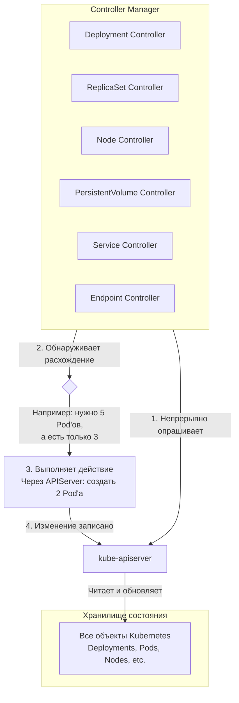

***
Controller Manager — непрерывно приводит текущее состояние кластера к желаемому.

**kube-controller-manager** — это один из главных компонентов Control Plane, который запускает в себе множество независимых **контроллеров** (control loops). Каждый контроллер отвечает за отслеживание одного типа ресурсов в системе и его приведение к желаемому состоянию.

---
### Аналогия

Представьте, что весь кластер Kubernetes — это фабрика.
*   **`etcd`** — это гигантская доска с заказами (желаемое состояние) и отчетами о текущем состоянии цехов.
*   **`kube-controller-manager`** — это главный управляющий, который постоянно бегает к этой доске, смотрит на заказы, смотрит на отчеты из цехов и отдает команды: "Здесь не хватает деталей, нужно сделать еще!", "А здесь станок сломался, надо починить!".
*   **`kube-scheduler`** — это диспетчер, который решает, в каком цеху (на какой ноде) выполнить новый заказ.
*   **`kubelet`** — это начальник цеха, который получает задание от диспетчера и ensures, что станки (контейнеры) работают.

---
### Из чего состоит Controller Manager?

Controller Manager — это **процесс**, внутри которого работают следующие ключевые встроенные контроллеры (неполный список, но охватывающий главное):
#### 1. Контроллеры, связанные с основными workload-объектами:
*   **Deployment Controller:** Отслеживает объекты Deployment. Его задача — обеспечить соответствие текущего состояния желаемому. Когда вы меняете образ в Deployment, именно этот контроллер создает новый ReplicaSet и начинает процесс rolling update.
*   **ReplicaSet Controller:** Отслеживает объекты ReplicaSet. Его задача — ensures, что запущено нужное количество идентичных Pod'ов. Если Pod умирает, он создает новый.
*   **StatefulSet Controller:** Управляет StatefulSet. Обеспечивает упорядоченное и предсказуемое развертывание stateful-приложений, управляет их устойчивыми томами и сетевыми идентификаторами.
*   **DaemonSet Controller:** Отслеживает DaemonSet. Его задача — ensures, что на каждой (или на подходящей) ноде работает копия Pod'а, определенного в DaemonSet.
*   **Job Controller:** Отслеживает объекты Job. Создает Pod'ы для выполнения задачи и следит за их успешным завершением.
*   **CronJob Controller:** Отслеживает объекты CronJob. Запускает Job'ы по расписанию.
#### 2. Контроллеры, связанные с сетью и сервисами:
*   **Endpoint Controller:** Наполняет объекты **Endpoints** (которые не создаются вручную). Он следит за Service'ами и Pod'ами. Когда Pod с подходящими метками появляется или исчезает, этот контроллер обновляет список IP-адресов в объекте Endpoints, связанном с Service'ом. Это то, что позволяет `kube-proxy` и Ingress-контроллерам знать, куда направлять трафик.
*   **Service Controller:** Отвечает за взаимодействие с cloud-провайдером. Когда вы создаете Service типа `LoadBalancer`, именно этот контроллер через API cloud-провайдера (AWS, GCP, Azure) создает внешний балансировщик нагрузки и настраивает его.
*   **Route Controller:** (Актуально для облачных провайдеров) Настраивает маршруты в cloud-подсетях.
#### 3. Контроллеры, связанные с узлами (нодами):
*   **Node Controller:** Отвечает за мониторинг состояния нод. Он проверяет, отвечают ли ноды (через механизм heartbeats, которые ноды отправляют в API Server). Если нода перестает отвечать, контроллер отмечает ее статус как `NotReady` и, через некоторое время, **выселяет (evicts)** все Pod'ы с этой ноды, чтобы их можно было пересоздать на других здоровых нодах. Это ключевой механизм отказоустойчивости.
#### 4. Контроллеры, связанные с постоянными данными:
*   **PersistentVolume Controller:** Связывает PersistentVolumeClaim (PVC) со свободными PersistentVolume (PV). Он постоянно ищет PVC, которые ждут подходящий том, и PV, которые доступны для использования, и "связывает" их друг с другом (устанавливает binding). Также отвечает за ресайклинг томов согласно политике `persistentVolumeReclaimPolicy`.

#### 5. Контроллеры, связанные с безопасностью и квотами:
*   **ServiceAccount Controller:** Обеспечивает существование объектов ServiceAccount по умолчанию внутри каждого namespace.
*   **ResourceQuota Controller:** Отслеживает использование ресурсов и ensures, что объекты, создаваемые в namespace, не нарушают ограничения, установленные в ResourceQuota.
*   **Namespace Controller:** Удаляет все объекты в namespace, когда сам namespace удаляется.

---
### Как работают все эти контроллеры? (Принцип Control Loop)

Все контроллеры работают по одной и той же схеме, в бесконечном цикле:

1.  **Считать желаемое состояние:** Получить из etcd (через API Server) объект, которым он управляет (например, ReplicaSet).
2.  **Считать текущее состояние:** Посмотреть, какое текущее состояние мира соответствует этому объекту (например, сколько Pod'ов с нужными метками сейчас запущено).
3.  **Сравнить:** Сравнить желаемое состояние (`spec.replicas: 5`) с текущим (`current replicas: 3`).
4.  **Внести изменения:** Если есть расхождение, сделать необходимые изменения через API Server, чтобы приблизить текущее состояние к желаемому (например, создать 2 новых Pod'а).
5.  **Повторить:** Записать изменения в etcd и начать цикл заново.

Этот цикл повторяется постоянно, делая систему Kubernetes **самовосстанавливающейся** и **декларативной**.

### Визуализация работы Controller Manager

### Где он работает?

**kube-controller-manager** — это **процесс, работающий на Control Plane (мастер-нодах)**. В высокодоступных кластерах его экземпляры запущены на всех мастер-нодах, но активным в каждый момент времени является только один (они используют механизм аренды — **leader election** — чтобы не конфликтовать друг с другом).

### Итог

**Controller Manager** — это не монолит, а сборник десятков независимых **контроллеров**, каждый из которых является экспертом в своей узкой области (ноды, тома, сети, реплики). Работая вместе в бесконечных циклах, они превращают ваши декларативные манифесты YAML в реально работающие приложения, обеспечивая отказоустойчивость и самовосстановление кластера. Это сердце операционной логики Kubernetes.

***
#devops #k8s 