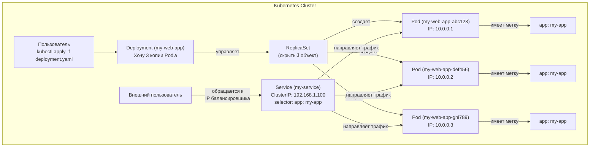

***
 [[Вопросы на собеседования по kubernetes|ВОПРОСЫ НА СОБЕСЕДОВАНИИ]]

- [[#АРХЕТИКТУРА K8S КЛАСТЕРА|АРХЕТИКТУРА K8S КЛАСТЕРА]]
- [[#ОСНОВНЫЕ ОБЪЕКТЫ K8S|ОСНОВНЫЕ ОБЪЕКТЫ K8S]]
- [[#СТРАТЕГИИ РАЗВЕРТЫВАНИЯ (Deployment Strategies)]]
- [[#СЕТЬ В K8S|СЕТЬ В K8S]]
- [[#Хранение данных|Хранение данных]]
- [[#Конфигурация и Secrets]]
- [[#Безопасность|Безопасность]]
- [[#Экосистема k8s.  Helm|Экосистема k8s.  Helm]]
- [[#Operators (операторы)|Operators (операторы)]]
- [[#МАСШТАБИРОВАНИЕ КЛАСТЕРА В K8S]]

***
## АРХЕТИКТУРА K8S КЛАСТЕРА

**Kubernetes** управляет кластером серверов. То есть просто несколькими серверами (виртуальные или физические) объедененных  в логическую группу. Каждый отдельный сервер называется нодой/node. 

**Кластер** — это группа серверов (нод), объединенных вместе в единую систему для совместной работы.

**Нода** — это один сервер (виртуальный или физический) в кластере, который является рабочим.

Кластер состоит из двух типов нод:

### Control Plane (Управляющая плоскость) 
  —  это одна или нескольно нод (называются Master-ноды) лоигчески объединённых.

Это мозг кластера. Управление всеми остальными серверами происходит отсуда. Master-нода принимает решения о том, где запускать приложения, отслеживает состояние кластера и реагирует на события (например, если рабочая нода падает). Обычно для надежности его запускают на нескольких серверах (больше 2-х). 

- **Компоненты Master Node:**
    
    - **API Server:** API через которое происходит управление кластером. Ты (или твои инструменты) общаешься с Kubernetes только через него (например команды `kubectl`).
        
    - **Scheduler:** 
        
    - **[[Controller Manager]]:** Запускает различные контроллеры, которые следят за тем, чтобы текущее состояние кластера совпадало с желаемым (например, если ты хотел 3 копии приложения, а одна упала, он создаст новую).
        
    - **etcd:** Высокодоступная и надежная база данных, в которой хранится состояние кластера. 

ВОПРОСЫ:
- [[Как взаимодействую несколько Master Node в Control Plane?]]
### Worker Node (Рабочие ноды)
Именно на этих серверах запускаются приложения (контейнеры).
 
 - **Компоненты каждой Worker Node:**
	
    - **Kubelet:** Агент, который работает на каждой ноде. Он получает команды от Control Plane (например, "запусти этот контейнер") и ensures, что контейнеры действительно запущены и здоровы.
        
    - **Kube-proxy:** Сетевой прокси, который обеспечивает сетевое взаимодействие между твоими приложениями (Pod'ами) внутри кластера и снаружи.
        
    - **Container Runtime:** Программное обеспечение, которое непосредственно запускает контейнеры (например, Docker, containerd, CRI-O). Kubelet общается с ним через CRI (Container Runtime Interface).

### Схема kubernetes кластера 
```
+-----------------------------------------------------------------------+
|                      Kubernetes Cluster                               |
|                                                                       |
|  +-----------------------------+                                      |
|  |       Control Plane         |                                      |
|  |  +-----------------------+  |                                      |
|  |  |      API Server       |  |<-- `kubectl create deployment ...`   |
|  |  +-----------------------+  |                                      |
|  |  |      Scheduler        |  |<--Планировщик "Запусти Pod на Node-2"|
|  |  +-----------------------+  |                                      |
|  |  | Controller Manager    |  |<-- "На Node-1 сломался Pod, чиним!"  |
|  |  +-----------------------+  |                                      |
|  |  |         etcd          |  |<-- (База данных кластера)            |
|  |  +-----------------------+  |                                      |
|  +-----------------------------+                                      |
|                                                                       |
|  +-------------+   +-------------+   +-------------+                  |
|  | Worker Node |   | Worker Node |   | Worker Node |                  |
|  | (node-1)    |   | (node-2)    |   | (node-3)    |                  |
|  |-------------|   |-------------|   |-------------|                  |
|  | • Kubelet   |   | • Kubelet   |   | • Kubelet   |                  |
|  | • Kube-proxy|   | • Kube-proxy|   | • Kube-proxy|                  |
|  | • Container |   | • Container |   | • Container |                  |
|  |   Runtime   |   |   Runtime   |   |   Runtime   |                  |
|  |             |   |             |   |             |                  |
|  | [Pod: Nginx]|   | [Pod: Redis]|   | [Pod: Web- ]|                  |
|  |             |   |             |   |   App]      |                  |
|  +-------------+   +-------------+   +-------------+                  |
+-----------------------------------------------------------------------+
```

#### Как это работает на практике:

1. Ты пишешь в терминале команду: `kubectl create deployment my-nginx --image=nginx`. Эта команда уходит к **API Server**.

2. Информация о том, что ты хочешь запустить `my-nginx`, записывается в **etcd**.

3. **Scheduler** видит, что нужно создать новый Pod, но он еще нигде не запущен. Он анализирует текущую загрузку всех **Worker Nodes** (сколько свободной памяти и CPU на node-1, node-2, node-3) и решает, что лучше всего запустить его на **node-2**.

4. **Scheduler** сообщает это решение API Server, который обновляет данные в **etcd**: "Pod `my-nginx` должен быть на node-2".

5. **Kubelet** на **node-2** постоянно опрашивает API Server: "Есть для меня новые задания?". Он видит новое задание для своей ноды.

6. **Kubelet** на **node-2** дает команду своему **Container Runtime** (например, containerd): "Скачай образ `nginx` и запусти контейнер".

7. **Container Runtime** скачивает образ и запускает контейнер.

8. **Kubelet** сообщает обратно в Control Plane, что Pod успешно запущен.
***
## ОСНОВНЫЕ ОБЪЕКТЫ K8S
***
## [[Объекты Kubernetes (Kubernetes Objects)]]
— это абстракции, которые вы создаете и управляете ими, чтобы рассказать Kubernetes, какое приложение вы хотите запустить и как оно должно работать.
#### 1. [[Pod ]](Под)
 — это наименьшая единица развертывания в Kubernetes. Это «обертка» для одного или нескольких контейнеров. 
 Внутри Pod'а контейнеры делят общие ресурсы: сеть (один IP-адрес), дисковое пространство (volumes).
 
 **Аналогия:** Если контейнер — это процесс (например, `nginx`), то Pod — это «виртуальная машина» или «хост» для этого процесса. 
 
 **Важно понять: Kubernetes управляет не контейнерами напрямую, а Pod'ами.**

 Pod'ы сами по себе эфемерны (временны). Они легко умирают и пересоздаются. **В одиночку их почти никогда не создают.** Для этого есть более высокоуровневые объекты.

***ВОПРОСЫ:***
- [[Зачем несколько контейнеров в одном Pod?]]

#### 2. [[Deployment]] (Развертывание)
Самый распространенный объект для управления stateless-приложениями (например, веб-серверы, API).

Deployment — это декларативное описание **желаемого состояния** для ваших Pod'ов. Вы говорите: «Я хочу, чтобы всегда работало 3 копии моего Pod'а с таким-то образом».

**Что он делает?**
    1.  **Создает и управляет** ReplicaSet'ами (объект ниже).
    2.  Обеспечивает **непрерывность работы**. Если Pod упал или его нода сломалась, Deployment автоматически создаст новый Pod на другой ноде.
    3.  Позволяет легко **обновлять приложение** (rolling update). Он постепенно создает Pod'ы с новой версией и убивает старые, обеспечивая нулевое время простоя.
    4.  Позволяет **откатиться** (rollback) на предыдущую версию, если что-то пошло не так.

**Пример `deployment.yaml`:**

```yaml
    apiVersion: apps/v1
    kind: Deployment # Тип объекта - Deployment
    metadata:
      name: my-web-app
    spec:
      replicas: 3 # ЖЕЛАЕМОЕ состояние: 3 копии Pod'а
      selector:
        matchLabels:
          app: my-app # Этот Deployment управляет всеми Pod'ами с этой меткой
      template: # Шаблон для создания Pod'ов
        metadata:
          labels:
            app: my-app # Метка, по которой Deployment находит свои Pod'ы
        spec: # Это spec для Pod'а (как в примере выше)
          containers:
          - name: nginx
            image: nginx:1.25
            ports:
            - containerPort: 80
```

---

#### 3. [[Service ]](Сервис)
**Постоянный сетевой интерфейс для доступа к вашим Pod'ам.**

*   **Проблема:** У Pod'ов непостоянные IP-адреса. Когда Pod умирает и пересоздается, его IP меняется. Как другим сервисам найти его?
*   **Решение:** Service. Это стабильная абстракция, которая определяет логический набор Pod'ов (обычно выбираемых по **меткам**, `label`) и политику доступа к ним.
*   **Как работает:** Service получает постоянный **VIP (виртуальный IP)** и **DNS-имя** внутри кластера. Когда вы обращаетесь к Service, он автоматически перенаправляет трафик на один из здоровых Pod'ов, входящих в его набор.
*   **Типы Services:**
    *   **ClusterIP** (по умолчанию): Доступен только внутри кластера.
    *   **NodePort:** Открывает порт на каждой ноде кластера, чтобы до сервиса можно было достучаться снаружи по `<IP_НОДЫ>:<PORT>`.
    *   **LoadBalancer:** Создает внешний cloud-балансировщик нагрузки (в AWS, GCP, Azure) и автоматически направляет трафик в сервис. Самый простой способ выставить приложение в интернет.
*   **Пример `service.yaml`:**
```yaml
    apiVersion: v1
    kind: Service
    metadata:
      name: my-service
    spec:
      selector:
        app: my-app # Service будет направлять трафик на ВСЕ Pod'ы с этой меткой
      ports:
        - protocol: TCP
          port: 80 # Порт, который слушает сам Service
          targetPort: 80 # Порт, на который он перенаправит трафик в Pod
      type: LoadBalancer # Делаем приложение доступным извне
```

---

#### 4. [[Namespace ]](Пространство имен)
**Виртуальный кластер внутри физического кластера.**

*   **Что это?** Механизм для изоляции групп ресурсов в одном кластере Kubernetes. Представьте, что это «папки» для ваших объектов.
*   **Зачем?**
    *   **Разделение сред:** `dev`, `staging`, `production`.
    *   **Разделение команд:** `team-a`, `team-b`.
    *   **Ограничение ресурсов:** Можно дать разным namespace разное количество CPU и памяти.
*   **Важно:** Сервисы внутри одного namespace могут обращаться друг к другу просто по имени (`my-service`). Для доступа к сервису из другого namespace нужно использовать полное доменное имя (FQDN): `my-service.my-namespace.svc.cluster.local`.
#### 5. [[ReplicaSet]]
#### 6. [[PersistentVolume]]
#### 7. [[Labels]]

### Визуализация работы основных объектов

Давайте свяжем все вместе на примере развертывания приложения:



**Краткий итог:**
1.  Вы создаете **Deployment**, чтобы описать, какое приложение запустить и в скольких копиях.
2.  Deployment через ReplicaSet создает и поддерживает нужное количество **Pod'ов**.
3.  Вы создаете **Service**, чтобы дать стабильную точку входа для доступа к этим Pod'ам.
4.  Все это можно изолировать в **Namespace**.

Это основа основ. Дальше можно изучать:
*   **ConfigMap & Secret:** Для хранения конфигурации и секретов (пароли, токены).
*   **Volume & PersistentVolume:** Для работы с постоянным дисковым пространством.
*   **StatefulSet:** Для управления stateful-приложениями (БД, Kafka), где каждому Pod'у нужно уникальное identity и постоянное хранилище.
*   **Ingress:** Для маршрутизации HTTP/HTTPS трафика в сервисы (более умная альтернатива LoadBalancer).

## Работа с объектами через kubectl

`kubectl` — это основной CLI-инструмент для взаимодействия с Kubernetes (командная строка)  
  
### Основные команды

`get` — просмотр ресурсов
```bash 
kubectl get pods# Список подов

kubectl get pods -n <namespace> # Список подов в определенном namespace

kubectl get all --all-namespaces #Список всех ресурсов в кластере

kubectl get nodes # Список нод кластера

kubectl get svc # Список сервисов
kubectl get deployments # Список deployments
kubectl get pod <pod-name> -o yaml # Вывод в формате YAML
kubectl get pod <pod-name> -o json# Вывод в формате JSON
```

`describe` — детальная информация
```bash
kubectl describe pod <pod-name> # Описание пода

kubectl describe node <node-name> # Описание ноды

kubectl describe svc <service-name> # Описание сервиса

```
  
`logs` — логи контейнеров
```bash

kubectl logs <pod-name> # Логи пода

kubectl logs -f <pod-name> # Логи пода с follow (аналог tail -f)

kubectl logs <pod-name> -c <container-name> # Логи конкретного контейнера в поде

kubectl logs --since=1h <pod-name> # Логи пода за последние 1 час

```
  
`exec` — выполнение команд в контейнере
```bash
# Запуск bash/sh в контейнере
kubectl exec -it <pod-name> -- /bin/bash
kubectl exec -it <pod-name> -- /bin/sh

# Выполнение команды без входа в контейнер
kubectl exec <pod-name> -- ls /app
```
  
`apply/delete` — управление ресурсами
```bash

kubectl apply -f deployment.yaml # Применение манифеста

kubectl delete -f deployment.yaml # Удаление ресурса

kubectl delete pod <pod-name> # Удаление пода по имени

kubectl delete pods --all -n <namespace> # Удаление всех подов в namespace
```

***
## [[СТРАТЕГИИ РАЗВЕРТЫВАНИЯ (Deployment Strategies)]]
***
1) Rolling Update (Постепенное обновление) — cтратегия по умолчанию для объектов Deployment.
	Мягкий деплой, поды заменяются постепенно для минимизации даунтайма, выведения старого пода и перенос с него трафика происходит только после проверки работоспособности нового.
2) Recreate (Пересоздание)
	Сначала удаляются все старые поды, затем создаются новые.
3) 3. Blue-Green (Сине-зелёное развертывание)
4) Canary (Канареечное развертывание)
5) A/B Testing (А/Б-тестирование) / Dark Launches

***
##   СЕТЬ В K8S
***
###   [[Services]]

**Сервисы (Services) —** абстракция, которая определяет набор подов и политику доступа к ним, создавая стабильную сетевую точку входа для приложений. Поды эфемерны (могут пересоздаваться с новыми IP), сервисы как раз обеспечивают:

- Постоянное DNS-имя (`<service>.<namespace>.svc.cluster.local`)
- Балансировку нагрузки между подами
- Стабильный IP и порт (ClusterIP)

Типы сервисов:

- **Cluster IP -** самый простой тип, доступный только внутри кластера по внутреннему IP-адресу.
- NodePort - расширяет ClusterIP, открывая доступ к сервису через определенный порт на всех нодах кластера.
- LoadBalancer - автоматически создает внешний балансировщик нагрузки в облачной среде, предоставляя внешний IP-адрес для доступа к сервису.
- ExternalName - делает маппинг на внешний ресурс посредством CNAME-записи  


### [[Ingress]]

Ingress нужен для балансировки HTTP/HTTPS трафика. Нужен для:  

- Маршрутизации на основе хостов и путей
- Терминации TLS (HTTPS)
- Замены для NodePort/LoadBalancer (экономия IP-адресов)

Ingress состоит из **Ingress Resource** (правила маршрутизации) и **Ingress Controller** (Nginx, Traefik или другие балансировщики).

В чем разница между Ingress и Service?  
  
Ingress на L7 (HTTP/HTTPS), Service на L4 (TCP/UDP), поэтому через ингресс можно настроить SSL серты  
Через Ingress более гибкая настройка правил (по сути - это балансировщик со всеми вытекающими)  
**Итого:**

- **Service** – базовая абстракция для доступа к подам (внутри или снаружи кластера).
- **Ingress** – надстройка для удобного управления веб-трафиком (роутинг, SSL, виртуальные хосты).
- **Ingress без Service не работает** – он лишь определяет правила, но не заменяет сервисы.
## Service Mesh

Решает задачи по управлению трафиком, задачи, связанные с безопасностью

**Service Mesh** — это инфраструктурный слой для управления коммуникацией между сервисами.

### Основные функции Service Mesh

**Load Balancing** – балансировка трафика  
**TLS/mTLS** – шифрование трафика между сервисами  
**Retries & Timeouts** – автоматические повторы запросов  
**Circuit Breaking** – защита от каскадных ошибок  
**Traffic Splitting (A/B тестирование, canary-развертывания)**  
  
Один из самых популярных - Istio.

Статья об Istio и примеры его использования - [https://habr.com/ru/companies/T1Holding/articles/837896/](https://habr.com/ru/companies/T1Holding/articles/837896/)
## DNS в k8s

За разрешение имен в k8s по умолчанию отвечает CoreDNS. Как это работает:

1. Когда под отправляет запрос на DNS-имя сервиса (например, `my-service.my-namespace.svc.cluster.local`), запрос поступает в CoreDNS.
2. CoreDNS определяет IP-адрес (ClusterIP) соответствующего сервиса.
3. Затем он возвращает этот IP-адрес запросившему поду, который уже может установить соединение с сервисом.

### Network Policies

Это инструмент, с помощью которого можно ограничивать трафик между подами для различных целей.  
  
Пример Network Policy (с комментариями что делает):
```yaml
apiVersion: networking.k8s.io/v1
kind: NetworkPolicy
metadata:
  name: db-isolation
spec:
  podSelector:
    matchLabels:
      app: database  # Применяется ко всем подам с меткой `app: database`
  policyTypes:
  - Ingress  # Правило регулирует входящий трафик (ingress)
  ingress:
  - from:
    - podSelector:
        matchLabels:
          app: backend  # Разрешает трафик ТОЛЬКО от подов с меткой `app: backend`
    ports:
    - port: 5432  # Разрешает подключение только к порту 5432 (PostgreSQL)

```

***
##  Хранение данных
***
В Kubernetes данные можно хранить с использованием **временных хранилищ** (связанных с контейнером и теряющихся при его удалении), **постоянных томов (Persistent Volumes — PV)**, создаваемых администраторами и обеспечивающих персистентность данных, а также **классов хранилищ (Storage Classes)**, которые определяют тип и характеристики подключаемых систем хранения (блочные, файловые, объектные) и позволяют автоматически создавать PV.

Временные хранилища:

- **EmptyDir -** создает временное хранилище, существующее в течение жизни пода
- **HostPath -** монтирует локальную файловую систему узла в под

Постоянные тома (Persistent Volumes, PV):

- **Persistent Volume** - представляет собой сегмент дискового пространства, который может быть предоставлен приложению в кластере и сохраняет данные после перезагрузки или удаления пода.
- **Persistent Volume Claim (PVC) -** запрос приложения на выделение хранилища определенного размера и типа, который абстрагирует детали физической реализации хранилища от приложения.
- **Storage Class -** это шаблон для динамического выделения постоянного хранилища (Persistent Volumes) для приложений, предоставляющий абстракцию над физическими системами хранения данных. Он определяет тип хранилища (например, по скорости или типу диска), параметры подключения к внешним системам (provisioner, parameters) и политику очистки (reclaimPolicy). Пользователи создают PVC, запрашивая хранилище определенного класса, а Kubernetes автоматически выделяет подходящий PV с помощью специального Provisioner (компонент k8s).

В чем разница между PV и PVC?

Просто объяснение:  

1. **PersistentVolume (PV)**

- Это **ресурс в кластере** (как реальный диск или его часть).
- Создается администратором или динамически через **StorageClass**.
- Пример: диск в облаке или NFS-шара.

3. **PersistentVolumeClaim (PVC)**

- Это **запрос приложения на выделение хранилища**.
- Пользователь (или разработчик) указывает, сколько места ему нужно (например, 10 ГБ) и, возможно, тип хранилища (быстрое SSD или обычный HDD).
- **Kubernetes сам ищет подходящий PV из имеющихся в кластере и связывает его с PVC.**
***
##   [[Конфигурация и Secrets]]
***
### ConfigMap

ConfigMap — это объект Kubernetes для хранения **неконфиденциальных** конфигурационных данных в формате ключ-значение. Используется для:

- Конфигурационных файлов
- Переменных окружения
- Параметров командной строки

Пробрасывается в Pod и может быть использован приложением при старте или в рантайме.

###   Secret

Secret — аналог ConfigMap, но для **конфиденциальных данных** (пароли, токены, ключи). Особенности:

- Хранятся в закодированном виде (base64)
- Могут шифроваться при хранении (с помощью EncryptionConfig)
- Передаются только на ноды, где нужны

Лучшей практикой является использование внешнего хранилища для Secrets, например, Vault и соответственно его интеграция в кластер k8s. Интеграция Vault и k8s происходит, например, через CSI Driver.

***
## Безопасность
***
### Аутентификация и авторизация

Происходит несколькими способами:

- **Client Certificates** (x509)
- **Bearer Tokens** (JWT для ServiceAccounts)
- **Аутентификация через Identity Provider** (OIDC, LDAP)
- **Webhook Token Authentication**

Users и Service Accounts - различия:

- **User accounts (Пользователи):** Люди или процессы вне кластера.
- **Service Accounts (Сервисные аккаунты):** Приложения и службы, работающие внутри кластера, которым нужен доступ к API.

**RBAC** (Role-Based Access Control) — это механизм управления доступом в Kubernetes, позволяющий назначать права пользователям, сервисным аккаунтам и группам на основе их ролей, а не на основе индивидуальных учетных записей. Он определяет, какие субъекты (пользователи, сервисы) могут выполнять какие действия над какими ресурсами (Pods, Deployments) в кластере. Для настройки RBAC используются сущности, такие как Roles и ClusterRoles (определяют разрешения), Subjects (пользователи, сервисные аккаунты, группы) и RoleBindings / ClusterRoleBindings (связывают субъектов с ролями).

Статья про авторизацию, аудит и RBAC - [https://habr.com/ru/companies/flant/articles/468679/](https://habr.com/ru/companies/flant/articles/468679/)

***
## Экосистема k8s.  Helm
***

Helm - пакетный менеджер для Kubernetes, аналог yum/apt в Linux, например.

- Упаковывает приложения в **чарты (charts)**
- Управляет зависимостями
- Разворачивает сервисы и приложения одной командой (`helm install`)

`# Добавить репозиторий helm repo add bitnami https://charts.bitnami.com/bitnami`

`# Установить PostgreSQL helm install my-postgres bitnami/postgresql`

`# Обновить конфигурацию helm upgrade my-postgres bitnami/postgresql --set postgresqlPassword=newpassword`

`# Удалить релиз helm uninstall my-postgres`

Для понимания, любой сервис (например, nginx, redis и др.) можно развернуть используя самописный yaml, но также можно использовать уже готовые helm-чарты.

### Когда что использовать?

- **Helm-чарт** — если нужно:

- Управлять сложными приложениями с множеством ресурсов.
- Переиспользовать конфигурации для разных окружений.
- Использовать готовые чарты из публичных репозиториев (например, для `nginx-ingress`, `cert-manager`).
- Версионировать и делиться конфигурациями.

- **Простой YAML** — если:

- Развёртываете что-то простое (например, один `Deployment` + `Service`).
- Нет необходимости в параметризации.
- Хотите минимализм без зависимостей.

Пример одного и того же разными способами:

**1. Простой YAML (`deployment.yaml`)**
```yaml
apiVersion: apps/v1
kind: Deployment
metadata:
  name: nginx
spec:
  replicas: 1
  template:
    spec:
      containers:
      - name: nginx
        image: nginx:1.25
        ports:
        - containerPort: 80
```


**2. Helm-чарт**
```bash
my-chart/
├── Chart.yaml          # Метаданные чарта
├── values.yaml         # Значения по умолчанию
└── templates/
    ├── deployment.yaml # Шаблон с переменными
    └── service.yaml
```


**`templates/deployment.yaml`** (с параметризацией):
```yaml
apiVersion: apps/v1
kind: Deployment
metadata:
  name: {{ .Release.Name }}-nginx
spec:
  replicas: {{ .Values.replicaCount }}
  template:
    spec:
      containers:
      - name: nginx
        image: {{ .Values.image }}
```

**`values.yaml`**

replicaCount: 1
image: nginx:1.25

***
## Operators (операторы)
***

**Operator** — это **пользовательский контроллер** (Custom Controller), который расширяет Kubernetes для управления **сложными приложениями**. Он:

- Использует **Custom Resource Definitions (CRD)** (например, `PostgresCluster`, `RedisCluster`).
- Может автоматизировать **бэкапы, восстановление, реконфигурацию, масштабирование кластеров** и другие задачи, которые, например, Deployment не умеет. Понимает специфику приложения, может принимать решения на основе состояния приложения.

**Пример: Развертывание PostgreSQL**

- **С Deployment**:

- Создается Deployment с контейнером PostgreSQL.
- Вручную настраиваете PersistentVolume, репликацию, бэкапы и остальное

- **С Operator**:

- Создается кастомный ресурс:  
    
```yaml
apiVersion: "acid.zalan.do/v1"
kind: "postgresql"
metadata:
  name: "my-db-cluster"
spec:
  replicas: 3
  users:
    admin:  # автоматически создаст пользователя в БД
  databases:
    myapp: admin  # создаст БД
```

- Оператор сам разворачивает кластер, настраивает репликацию, делает бэкапы, обрабатывает сбои.

***
##   [[МАСШТАБИРОВАНИЕ КЛАСТЕРА В K8S]]
***
Существует несколько видов масштабирования: HPA, VPA, Cluster Autoscaler

  
**HPA** - горизонтальное масштабирование. HPA автоматически увеличивает или уменьшает количество реплик подов на основе метрик по cpu/ram. Если же нужна более гибкая настройка (например, по количеству сообщений из Kafka) - здесь приходит на помощь event-driven scaler'ы, например Keda.

**VPA** - вертикальное масштабирование. Может регулировать количество вычислительных ресурсов (requests/limits) для контейнеров по значениям опять же из метрик.

**Cluster Autoscaler** - автоматически добавляет/удаляет ноды в кластере при:

- Нехватке ресурсов для планирования подов
- Низкой загрузке нод (экономия затрат)

Это актуально только либо для облаков, либо при наличии открытого API в vSphere для виртуализации.

***
#devops  #k8s