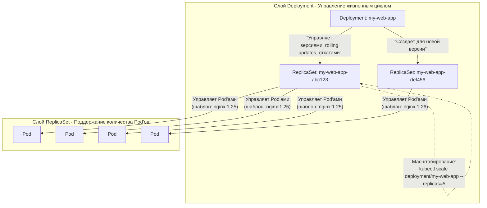

***
**Deployment — это НЕ файл и НЕ процесс. Deployment — это объект (сущность, запись) внутри базы данных Kubernetes (etcd), который представляет собой желаемое состояние вашего приложения.**

### Аналогия: Чертеж и Строитель

Представьте, что вы архитектор, а Kubernetes — это огромная строительная компания с роботами-строителями.

1.  **`.yaml` файл (например, `deployment.yaml`) — это ваш ЧЕРТЕЖ.**
    *   Вы на бумаге (в файле) описываете, *что* вы хотите построить: "Мне нужен трехэтажный дом с красной крышей и пятью окнами на фасаде".
    *   Это просто текст. Сам по себе этот файл ничего не делает. Он лежит у вас на компьютере.

2.  **Команда `kubectl apply -f deployment.yaml` — это передача чертежа прорабу.**
    *   Вы отдаете свой чертеж (файл) прорабу (команда `kubectl`).
    *   Прораб (`kubectl`) относит этот чертеж в главный офис строительной компании (**API Server** Kubernetes).

3.  **Deployment — это ЗАДАНИЕ, внесенное в базу данных офиса.**
    *   В офисе (**Control Plane**) clerk заносит информацию из вашего чертежа в официальный журнал заказов (базу данных **etcd**).
    *   Теперь в журнале есть запись: *"Заказчик хочет один трехэтажный дом с красной крышей. Текущее состояние: еще не построен"*.
    *   **Эта ЗАПИСЬ в журнале и есть объект `Deployment`.** Он существует как желаемое состояние.

4.  **Процессы Control Plane (Scheduler, Controller Manager) — это РОБОТЫ-СТРОИТЕЛИ.**
    *   Робот-менеджер (**Controller Manager**) постоянно сверяется с журналом (etcd). Он видит: "Ага, в журнале есть желание иметь дом, но самого дома еще нет. Надо это исправить!".
    *   Он отдает команду другим роботам: создать фундамент (Pod), подвести коммуникации и т.д.

5.  **Pod's — это реальный, построенный ДОМ.**
    *   Роботы-строители (**kubelet** на нодах) физически строят дом (запускают **контейнеры**) на участке земли (**Worker Node**).
    *   Это уже реальный, работающий процесс.


### Что же такое Deployment? 

*   **Deployment — это декларативное желание, записанное в etcd.**
    Вы говорите: "Я хочу, чтобы ВСЕГДА было 3 копии моего приложения `nginx` версии `1.25`". Kubernetes берет на себя ответственность за то, чтобы реальность всегда соответствовала этому желанию.

*   **Deployment — это НЕ процесс.**
    Процессы — это ваши контейнеры `nginx`, которые работают внутри Pod'ов. Deployment сам по себе не потребляет CPU и память. Он лишь управляет этими процессами.

*   **Deployment — это НЕ файл.**
    Файл `.yaml` — это всего лишь способ ОПИСАТЬ этот объект и передать его Kubernetes. Вы можете удалить файл `deployment.yaml` со своего компьютера после запуска — на самом кластере Deployment продолжит существовать и работать.

*   **Deployment — это абстракция более высокого уровня.**
    Его главная задача — управлять жизненным циклом приложения (создание, обновление, откат, масштабирование), скрывая от вас низкоуровневые детали работы с отдельными Pod'ами.

### Как это увидеть на практике?

Вы можете взаимодействовать с объектом Deployment, даже не зная о существовании файла:

1.  **Посмотреть все Deployment в кластере:**
```bash
    kubectl get deployments
```
Вывод покажет вам сами объекты, а не файлы.
```
    NAME       READY   UP-TO-DATE   AVAILABLE   AGE
    my-web-app   3/3     3            3           5m
```


2.  **Посмотреть детали конкретного Deployment:**
   ```bash
    kubectl describe deployment my-web-app
    ```
Эта команда покажет всю информацию, которая хранится в этом объекте внутри etcd: его историю, стратегию обновления, метки, условия и т.д.


3.  **Изменить Deployment без файла:**
  ```bash
    kubectl scale deployment/my-web-app --replicas=5
    ```
Вы только что изменили желаемое состояние объекта Deployment прямо в etcd, приказав ему иметь 5 копий вместо 3. Kubernetes немедленно начнет приводить реальность в соответствие, создав 2 новых Pod'а.

**Итог:** `.yaml` файл — это рецепт. `Deployment` — это заказ, принятый кухней (Kubernetes). `Pod`'ы — это готовые блюда, которые подаются клиентам (трафику).


Давайте закрепим это понимание, пройдясь по всему циклу еще раз, но чуть более технически.

1.  **Deployment хранится в etcd.**
2.  **Controller Manager** (а конкретно — `Deployment controller`) его "видит".
3.  **Controller Manager** создает другие объекты (ReplicaSet) для реализации желаемого состояния.
4.  **Scheduler** принимает решение, *где* запустить Pod'ы.
5.  В результате на нодах создаются **Pod'ы**.

---

### Детализация процесса (Что происходит под капотом)

Давайте разберем вашу фразу шаг за шагом на примере команды `kubectl apply -f deployment.yaml`.

**Шаг 1: `Deployment` хранится в `etcd`**
*   Вы отправляете `deployment.yaml` через `kubectl`.
*   `kube-apiserver` проверяет его и записывает как новую запись в базу данных `etcd`.
*   **Теперь объект `Deployment` существует в системе.** Его желаемое состояние (`spec`): "3 реплики Pod'а с таким-то шаблоном".

**Шаг 2: `Controller Manager` и его `Deployment Controller`**
*   Внутри `kube-controller-manager` работает множество независимых **контроллеров** (control loops).
*   Один из них — **Deployment Controller**. Он в бесконечном цикле опрашивает API Server: "Есть ли новые Deployment'ы или изменения в существующих?"
*   Он видит ваш новый Deployment в `etcd`. Его задача — обеспечить, чтобы текущее состояние мира соответствовало вашему желанию.
*   **Важно:** Deployment Controller *не создает Pod'ы напрямую*. Вместо этого он создает или изменяет другой объект — **ReplicaSet**.

**Шаг 3: Создание `ReplicaSet`**
*   `ReplicaSet` — это объект, чья единственная задача — поддерживать заданное количество идентичных Pod'ов (`replicas`).
*   Deployment Controller создает в `etcd` объект `ReplicaSet`. Часть информации (например, число реплик) он берет из вашего `Deployment`.

**Шаг 4: `ReplicaSet Controller`**
*   Это другой контроллер внутри `Controller Manager`. Он следит за объектами `ReplicaSet`.
*   Он видит, что только что созданный `ReplicaSet` хочет 3 Pod'а, но их сейчас 0.
*   **ReplicaSet Controller создает в `etcd` 3 объекта `Pod`.** Но у этих Pod'ов еще нет поля `nodeName` — это просто "желание" иметь Pod, без привязки к конкретной машине.

**Шаг 5: `Kube-Scheduler`**
*   `Scheduler` постоянно ищет в `etcd` Pod'ы, у которых не указана нода (`nodeName` is empty).
*   Он находит 3 свежесозданных Pod'а от `ReplicaSet`.
*   **Scheduler проводит сложный выбор:** он анализирует все рабочие ноды, учитывая их загрузку (свободные CPU/RAM), правила (`affinity/anti-affinity`), taints/tolerations и т.д.
*   Приняв решение, `Scheduler` **не запускает Pod**. Он лишь *назначает* Pod ноде, обновляя поле `nodeName` у объекта `Pod` в `etcd`.

**Шаг 6: `Kubelet` на Worker Node**
*   Каждый `Kubelet` на своей ноде постоянно опрашивает API Server: "Есть ли Pod'ы с `nodeName`, равным моему имени?"
*   `Kubelet` на назначенной ноде видит, что ему в работу пришел новый Pod.
*   **Вот тут происходит магия:** `Kubelet` через **Container Runtime Interface (CRI)** (например, `containerd`) дает команду скачать образ и запустить контейнер(ы), описанные в Pod.
*   После запуска `Kubelet` сообщает обратно в `etcd` о текущем статусе Pod'а (`Running`, `Error` и т.д.).

**Шаг 7: Замыкание цикла**
*   `ReplicaSet Controller` видит, что теперь есть 3 запущенных Pod'а. Желаемое состояние достигнуто. Он успокаивается... до тех пор, пока один из Pod'ов не умрет, и тогда цикл начнется снова для его восстановления.


**Deployment (в etcd) -> Контроллеры (Controller Manager) -> ReplicaSet (в etcd) -> Контроллеры (Controller Manager) -> Pod (в etcd) -> Scheduler -> Pod (назначен ноде в etcd) -> Kubelet -> Запущенные контейнеры.**

Вы прекрасно усвоили концепцию! Это основа работы Kubernetes.


Взаимодействие с replicaset
Отлично! Давайте разберем этот процесс **максимально подробно**, шаг за шагом. Это именно то, что происходит "под капотом" после команды `kubectl apply -f deployment.yaml`.

Допустим, у нас есть простой Deployment:

```yaml
apiVersion: apps/v1
kind: Deployment
metadata:
  name: my-web-app
spec:
  replicas: 3
  selector:
    matchLabels:
      app: my-app
  template:
    metadata:
      labels:
        app: my-app
    spec:
      containers:
      - name: nginx
        image: nginx:1.25
        ports:
        - containerPort: 80
```

---

### Пошаговое путешествие нашего Deployment'а

**Шаг 0: Отправка манифеста (`kubectl apply`)**
Вы выполняете команду. `kubectl` читает файл и отправляет его содержимое в **API Server**.

**Шаг 1: Запись в etcd**
*   **API Server** проверяет валидность манифеста, аутентифицирует и авторизует запрос.
*   Если все хорошо, он **сохраняет объект Deployment как новую запись в базу данных etcd**.
*   Теперь состояние кластера выглядит так: *"Есть желание (Desired State) иметь объект Deployment `my-web-app` с 3 репликами Pod'а по шаблону `nginx:1.25`"*.

**Шаг 2: Вступает в дело Deployment Controller**
*   Внутри **Controller Manager'а** работает **Deployment Controller**.
*   Он в бесконечном цикле опрашивает API Server: *"Есть ли изменения в Deployment'ах?"*
*   Он обнаруживает в etcd новый объект Deployment `my-web-app`. Его цель — сделать так, чтобы текущее состояние мира соответствовало желанию, описанному в этом Deployment.

**Шаг 3: Создание ReplicaSet'а**
*   Deployment Controller понимает, что для этого Deployment'а еще не существует подчиненного ReplicaSet'а.
*   **Он создает объект ReplicaSet!** Он вычисляет уникальное имя для этого ReplicaSet'а (обычно based на имени Deployment'а и хэше шаблона Pod'а, например, `my-web-app-5d5d6f64d8`).
*   **Важно:** Вся информация о том, *какие Pod'ы запускать* (`template`) и *сколько их* (`replicas: 3`), копируется из Deployment в спецификацию нового ReplicaSet'а.
*   Deployment Controller через API Server **сохраняет этот новый объект ReplicaSet в etcd**.

**Шаг 4: Вступает в дело ReplicaSet Controller**
*   В том же Controller Manager'е работает **ReplicaSet Controller**.
*   Он в своем цикле опрашивает: *"Есть ли новые ReplicaSet'ы или изменения в них?"*
*   Он видит новый ReplicaSet `my-web-app-5d5d6f64d8`, который хочет 3 Pod'а (`replicas: 3`).
*   Он проверяет, сколько Pod'ов *с метками `app: my-app`* уже существует в кластере. Их 0.
*   Чтобы исправить это несоответствие, он **создает 3 объекта Pod через API Server**, которые также записываются в etcd. У этих Pod'ов еще нет назначенной ноды (`nodeName` не указан).

**Шаг 5: Вступает в дело Scheduler (Планировщик)**
*   **Kube-Scheduler** видит в etcd три новых Pod'а, у которых не указана нода.
*   Для каждого Pod'а он выполняет сложный процесс:
    1.  **Фильтрация:** Отсеивает все ноды, которые не подходят по критериям (недостаточно ресурсов, не совпадают taints/tolerations и т.д.).
    2.  **Скоринг:** Оставшимся подходящим нодам выставляет "баллы" (например, у какой ноды больше свободной RAM).
*   Scheduler принимает решение и **привязывает Pod к конкретной ноде**, обновляя поле `spec.nodeName` у объекта Pod в etcd.

**Шаг 6: Вступают в дело Kubelet и Container Runtime**
*   **Kubelet** на каждой рабочей ноде постоянно спрашивает API Server: *"Есть ли для меня Pod'ы?"*
*   **Kubelet'ы** на тех нодах, которым Scheduler назначил Pod'ы, видят новое задание.
*   Каждый Kubelet получает детали Pod'а из etcd и командует своему **Container Runtime** (например, containerd): *"Скачай образ `nginx:1.25` и запусти контейнер с такими-то параметрами"*.
*   Container Runtime запускает контейнер(ы).
*   **Kubelet** сообщает обратно в API Server о статусе Pod'а (`Running`), и это состояние сохраняется в etcd.

**Шаг 7: Круг замыкается**
*   **ReplicaSet Controller** видит, что теперь существует 3 запущенных Pod'а с меткой `app: my-app`. Желаемое состояние достигнуто. Он успокаивается до тех пор, пока что-то не изменится.
*   **Deployment Controller** видит, что его подчиненный ReplicaSet имеет 3 готовых Pod'а. Желаемое состояние Deployment'а тоже достигнуто.

---

### Визуализация процесса

Вот как выглядит вся цепочка управления после того, как Deployment создан:



### Что происходит при обновлении? (Волшебство Deployment'а)

Допустим, вы меняете образ в манифесте на `nginx:1.26` и снова применяете `kubectl apply`.

1.  **API Server** обновляет запись Deployment'а в etcd.
2.  **Deployment Controller** замечает изменение в `.spec.template` (шаблон Pod'а изменился). Он понимает, что это требует **обновления**.
3.  Он **создает новый ReplicaSet** с именем по новому хэшу шаблона, например, `my-web-app-77c98d4c8b`. В его спецификации уже `replicas: 3` и новый образ `nginx:1.26`.
4.  По стратегии обновления по умолчанию (`RollingUpdate`) Deployment Controller начинает **плавный переход**:
    *   Он говорит *новому* ReplicaSet: *"Увеличь количество реплик на 1"* (станет `replicas: 1`).
    *   Он говорит *старому* ReplicaSet: *"Уменьшь количество реплик на 1"* (станет `replicas: 2`).
5.  **ReplicaSet Controller'ы** каждого из ReplicaSet'ов реагируют на эти изменения: один создает Pod с версией 1.26, другой удаляет Pod с версией 1.25.
6.  Этот процесс повторяется, пока новый ReplicaSet не будет управлять всеми 3 Pod'ами, а старый — нулем.
7.  Старый ReplicaSet **не удаляется**. Он остается в истории, чтобы при необходимости можно было легко откатиться.

**Итог:** Deployment — это менеджер, который через управление ReplicaSet'ами (их создание, масштабирование и удаление) реализует сложные операции жизненного цикла приложения. ReplicaSet — это его простой и надежный инструмент для поддержания нужного количества Pod'ов.

***
#devops #k8s 