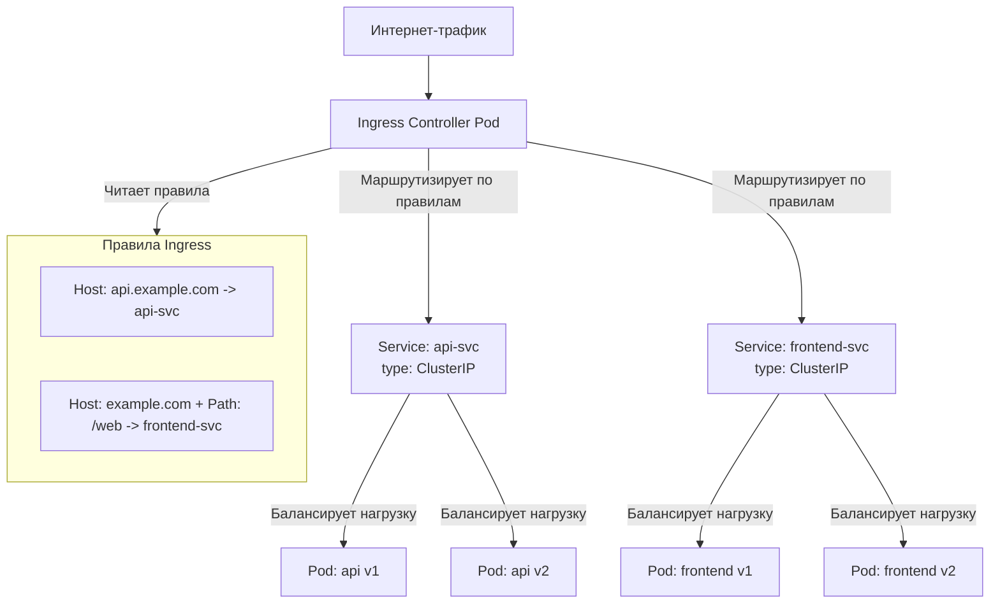

Идеально! **Services (Сервисы)** и **Ingress** — это два фундаментальных сетевых абстракции в Kubernetes, которые решают разные, но взаимодополняющие задачи: **Service** обеспечивает внутреннюю сетевую связность, а **Ingress** управляет входящим внешним трафиком.

Давайте разберем их по порядку.

---

### Service (Сервис)

#### Что это?
**Service** — это абстракция, которая определяет постоянную точку доступа к набору динамически меняющихся Pod'ов. Это **стабильный сетевой идентификатор** для вашего приложения внутри кластера.

#### Проблема, которую решает Service:
У Pod'ов есть "проблемы с идентификацией":
1.  **Динамические IP:** Каждый Pod получает свой собственный IP-адрес, но при перезапуске, обновлении или масштабировании этот IP **меняется**.
2.  **Непостоянство:** Если Pod умирает, его IP становится невалидным.
3.  **Балансировка:** Как автоматически распределять трафик между несколькими копиями Pod'ов (репликами)?

**Аналогия:** Service — это **телефонный номер call-центра**. Номера операторов (IP Pod'ов) могут меняться, люди могут уходить на обед (Pod'ы умирать), но клиенты всегда звонят на один общий номер (Service), который автоматически соединяет их со свободным оператором.

#### Как это работает?
Service не является процессом или прокси-сервером. Это, в первую очередь, **правило для `kube-proxy`**.
1.  Вы создаете Service с **селектором меток** (например, `app: my-api`).
2.  Service Controller постоянно следит за Pod'ами и для каждого Service создает **эндпоинты (Endpoints)** — список IP-адресов и портов всех Pod'ов, которые match-ат селектору.
3.  **`kube-proxy`** (агент, работающий на каждой ноде) получает информацию об этих правилах.
4.  `kube-proxy` настроит правила iptables/IPVS на своей ноде так, чтобы любой трафик, направленный на **виртуальный IP-адрес (ClusterIP)** Service, автоматически перенаправлялся на один из IP-адресов Pod'а из списка эндпоинтов. Это и есть балансировка нагрузки.

#### Типы Services:

| Тип | Для чего нужен? | Как доступен? |
| :--- | :--- | :--- |
| **`ClusterIP`** (по умолчанию) | Для связи между компонентами **внутри кластера**. | Только по внутреннему виртуальному IP (VIP) внутри кластера. |
| **`NodePort`** | Чтобы сделать сервис доступным снаружи кластера по фиксированному порту **на каждой ноде**. | `<IP_ЛЮБОЙ_НОДЫ>:<STATIC_PORT>` (диапазон 30000-32767). |
| **`LoadBalancer`** | Чтобы интегрироваться с облачным провайдером (AWS, GCP, Azure) и **автоматически создать внешний балансировщик нагрузки**. | По уникальному внешнему IP-адресу, который выдает cloud-провайдер. |

**Пример Service (тип ClusterIP):**
```yaml
apiVersion: v1
kind: Service
metadata:
  name: my-internal-service
spec:
  type: ClusterIP # Можно не указывать, это значение по умолчанию
  selector:
    app: my-app # Находит все Pod'ы с этой меткой
    tier: backend
  ports:
    - protocol: TCP
      port: 80 # Порт, который слушает сам Service
      targetPort: 8080 # Порт, на который перенаправить трафик в Pod
```

---

### Ingress

#### Что это?
**Ingress** — это не тип Service, а **отдельный объект API**. Его задача — управлять входящим HTTP/HTTPS трафиком извне в сервисы внутри кластера. Это **"умный роутер"** для HTTP-трафика.

#### Проблема, которую решает Ingress:
У Service типа `LoadBalancer` есть limitations:
1.  **Дорого:** Каждый Service `LoadBalancer` создает свой собственный cloud-балансировщик, за который нужно платить.
2.  **"Тупой" L4:** Cloud-балансировщики работают на 4-м уровне модели OSI (TCP/UDP). Они не умеют смотреть *внутрь* HTTP-запроса (например, на hostname или путь в URL).

**Аналогия:** Если Service `LoadBalancer` — это выделенная телефонная линия для каждого отдела, то **Ingress** — это единая АТС с оператором. Вы звоните на один общий номер, а оператор (Ingress) спрашивает: "Вам какой отдел?" и, в зависимости от вашего ответа (hostname или путь в URL), соединяет с нужной линией (Service).

#### Как это работает?
1.  Вам нужно установить в кластер **Ingress-контроллер** (например, Nginx Ingress Controller, Traefik, Istio Ingress Gateway). Это Pod, который как раз и будет обрабатывать трафик.
2.  Вы создаете **объект Ingress**, который содержит набор **правил маршрутизации**.
3.  Ingress-контроллер следит за API и, видя ваш Ingress-объект, конфигурирует себя согласно этим правилам.
4.  Внешний трафик приходит на Ingress-контроллер (часто через Service типа `LoadBalancer`, который создается для самого контроллера).
5.  Ingress-контроллер анализирует HTTP-запрос (смотрит на заголовок `Host` и путь `path`) и перенаправляет его на соответствующий *внутренний* Service (обычно типа `ClusterIP`).

**Возможности Ingress:**
*   **Маршрутизация на основе хоста:** `blog.example.com` -> Service `blog`, `api.example.com` -> Service `api`.
*   **Маршрутизация на основе пути:** `example.com/shop` -> Service `shop`, `example.com/blog` -> Service `blog`.
*   **Termination TLS/SSL:** Ingress-контроллер может сам заниматься расшифровкой HTTPS-трафика, используя секреты с сертификатами.
*   **Настройка правил:** Rewrite URL, authentication, CORS, rate-limiting (зависит от возможностей контроллера).

**Пример Ingress:**
```yaml
apiVersion: networking.k8s.io/v1
kind: Ingress
metadata:
  name: my-ingress
  annotations:
    nginx.ingress.kubernetes.io/rewrite-target: / # Аннотации для настройки контроллера
spec:
  tls: # Настройка HTTPS
  - hosts:
      - my-app.com
    secretName: my-tls-secret # Секрет с сертификатом
  rules:
  - host: my-app.com # Правило для домена
    http:
      paths:
      - path: /api
        pathType: Prefix
        backend:
          service:
            name: api-service # Перенаправлять на этот Service...
            port:
              number: 80      # ...на этот порт
      - path: /
        pathType: Prefix
        backend:
          service:
            name: web-frontend-service
            port:
              number: 80
```

---

### Визуализация: Как всё работает вместе



### Сравнительная таблица: Service vs Ingress

| Характеристика | Service | Ingress |
| :--- | :--- | :--- |
| **Уровень работы (OSI)** | **L4 (Transport)** - TCP/UDP | **L7 (Application)** - HTTP/HTTPS |
| **Основная задача** | Постоянный IP и балансировка **между Pod'ами** | Маршрутизация **входящего HTTP-трафика между Service'ами** |
| **Внешний доступ** | `NodePort`, `LoadBalancer` | **Требует** установки Ingress-контроллера |
| **Протоколы** | Любой TCP/UDP-трафик | В основном HTTP/HTTPS (некоторые контроллеры умеют gRPC, WebSocket) |
| **Экономичность** | `LoadBalancer` создает дорогой ресурс на сервис | **Один** LoadBalancer на весь кластер, управляющий множеством правил |

### Итог

*   **Service** — это ваша **внутренняя сеть**. Он даёт стабильные DNS-имена и IP-адреса для общения микросервисов друг с другом.
*   **Ingress** — это ваш **внешний фасад**. Он является точкой входа для всего внешнего веб-трафика и умно распределяет его по внутренним сервисам на основе URL.

Они не исключают, а **дополняют** друг друга. Обычная схема: вы создаете Service типа `ClusterIP` для вашего приложения, а затем создаете правило Ingress, которое направляет трафик на этот Service.