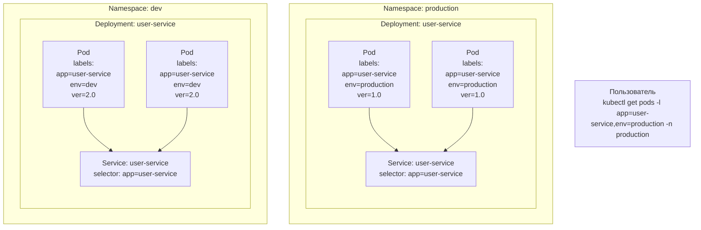

***
**Labels** — это пары **ключ=значение**, которые attachятся к объектам Kubernetes (Pod'ам, Deployment'ам, Service'ам и т.д.). Метки используются для идентификации **атрибутов** объектов, которые важны для пользователей.

#### Для чего нужно?
1.  **Идентификация и организация:** Помечать объекты по принадлежности, цели, версии и т.д.
    *   `app: user-service` (какому приложению принадлежит)
    *   `tier: frontend` (к какому слою принадлежит — frontend, backend, cache)
    *   `environment: dev` (для какого окружения предназначен)
    *   `version: v2.1.0` (версия приложения)
2.  **Выбор объектов (Selection):** Это самая мощная функция. Другие объекты используют **селекторы меток (label selectors)**, чтобы найти и сгруппировать нужные им объекты.

#### Как и где используется?
*   **В манифестах YAML:** Метки указываются в разделе `metadata.labels` объекта. Они также могут быть у `spec.template.metadata.labels` в Deployment (это метки для Pod'ов, которые он создает).
    ```yaml
    apiVersion: apps/v1
    kind: Deployment
    metadata:
      name: user-service
      labels: # Метки самого Deployment
        app: user-service
        tier: backend
        track: stable
    spec:
      selector:
        matchLabels:
          app: user-service # Селектор для управления Pod'ами
      template:
        metadata:
          labels: # Метки для Pod'ов! Должны совпадать с селектором выше.
            app: user-service
            tier: backend
            environment: production
            version: "1.0"
    ```
*   **Селекторы в Service:** Service использует селектор, чтобы понять, к каким Pod'ам направлять трафик.
    ```yaml
    apiVersion: v1
    kind: Service
    metadata:
      name: user-service
    spec:
      selector: # Селектор меток! Service найдёт ВСЕ Pod'ы с этими метками.
        app: user-service
        tier: backend
      ports:
      - port: 80
        targetPort: 8080
    ```
*   **Команды для работы:**
    ```bash
    # Показать все Pod'ы с определённой меткой
    kubectl get pods -l app=user-service

    # Показать Pod'ы с меткой environment=production И app=nginx
    kubectl get pods -l environment=production,app=nginx

    # Показать Pod'ы с меткой tier, значение которой либо frontend, либо backend
    kubectl get pods -l 'tier in (frontend, backend)'

    # Добавить метку к уже существующему Pod'у
    kubectl label pods my-pod environment=test

    # Обновить метку (добавить --overwrite)
    kubectl label pods my-pod environment=prod --overwrite
    ```

---

### Визуализация: Как всё это работает вместе



**Что иллюстрирует диаграмма:**
1.  **Изоляция Namespace:** В кластере есть два абсолютно независимых Deployment'а `user-service` с разными версиями приложения. Они находятся в разных "комнатах" — `production` и `dev`.
2.  **Работа Labels и Selectors:**
    *   Service `user-service` в namespace `production` имеет селектор `app=user-service`.
    *   Он **выбирает только Pod'ы в своем namespace** с такими метками и направляет на них трафик. Он не видит Pod'ы в namespace `dev`, даже though у них такие же метки.
    *   Команда пользователя использует метки (`-l app=user-service,env=production`) для точного выбора нужных объектов в нужном namespace (`-n production`).


***
#devops #k8s 