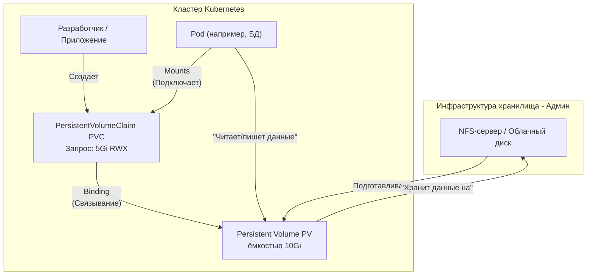
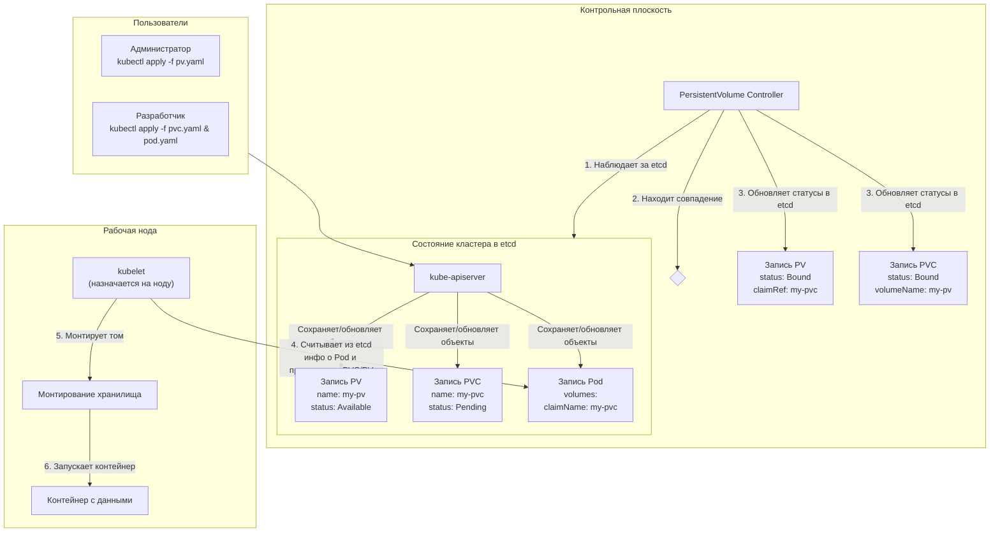

***
**Persistent Volumes (PV, Персистентные тома)** —  нужны для как сохранения данных, когда Pod'ы умирают и пересоздаются.


### Проблема: Эфемерность Pod'ов

Давайте вспомним:
*   Pod'ы в Kubernetes — **временны (эфемерны)**. Они могут быть убиты и пересозданы в любой момент (из-за обновления, сбоя, масштабирования).
*   Файловая система внутри контейнера **временна**. Когда контейнер умирает, все данные, записанные в него, теряются.
*   Но многим приложениям **нужно постоянное хранилище** (persistent storage):
    *   **Базы данных** (MySQL, PostgreSQL, MongoDB)
    *   **Кэши** (Redis)
    *   **Файловые хранилища** (загрузки пользователей, конфиги)
    *   **Брокеры сообщений** (Kafka, RabbitMQ)

Как быть? Нужно "отделить" данные от самого контейнера.

---

### Решение: Persistent Volumes (PV)

**Persistent Volume (PV)** — это кусок сетевого хранилища в кластере Kubernetes, который был **заготовлен администратором** или динамически создан по запросу.

**Простая аналогия:** Представьте, что Pod — это арендатор, который может въезжать и выезжать из квартиры. **Persistent Volume — это сама квартира с ее мебелью и вещами.** Арендатор (Pod) может смениться, но квартира (PV) и все, что в ней лежит, остаются нетронутыми.

#### Ключевые характеристики PV:
1.  **Не зависит от жизненного цикла Pod'а.** PV существует, даже если ни один Pod его не использует.
2.  **Ресурс кластера.** PV так же является ресурсом кластера, как и CPU или оперативная память. Администратор заранее подготавливает пул PV определенного размера.
3.  **Использует внешнее хранилище.** PV — это не место на диске ноды! Это абстракция над **сетевым хранилищем** (например, NFS-сервер, дисковые массины в облаке AWS EBS, GCP Persistent Disk, Azure Disk, Ceph, iSCSI и т.д.).

---

### Как Pod'ы получают доступ к PV? Через PersistentVolumeClaim (PVC)

Pod'ы не запрашивают PV напрямую. Для этого есть еще одна абстракция — **PersistentVolumeClaim (PVC, Заявка на постоянный том)**.

**Аналогия:**
*   **Persistent Volume (PV)** — это складское помещение разного размера (10Gi, 50Gi, 100Gi), которое администратор подготовил и добавил в каталог.
*   **PersistentVolumeClaim (PVC)** — это заявка от разработчика (или приложения): "Мне нужно 5Gi хранилища с возможностью чтения и записи".
*   **Kubernetes** — это менеджер по аренде. Он ищет в каталоге подходящий свободный склад (PV), который удовлетворяет требованиям заявки (PVC), и связывает их друг с другом (**Binding**).
*   **Pod** — это арендатор, который в своей заявке на аренду (в манифесте Pod'а) указывает: "Мне нужно то хранилище, которое описано в заявке PVC с именем `my-data-claim`".

---

### Визуализация полного цикла



---

### Примеры манифестов

#### 1. PersistentVolume (PV) (готовится администратором)
```yaml
apiVersion: v1
kind: PersistentVolume
metadata:
  name: my-pv  # Имя тома
spec:
  capacity:
    storage: 10Gi  # Емкость тома
  accessModes:
    - ReadWriteOnce  # Режим доступа: том может быть подключен на запись только одной нодой
  persistentVolumeReclaimPolicy: Retain # Что делать с томом после удаления PVC: Retain (сохранить данные)
  storageClassName: slow # Имя класса хранилища (опционально)
  nfs:  # Конкретный бэкенд - NFS-сервер
    path: /var/nfs/data
    server: 10.0.0.100
```
*(Вместо `nfs` может быть `awsElasticBlockStore`, `gcePersistentDisk`, `azureDisk` и т.д.)*

#### 2. PersistentVolumeClaim (PVC) (создается разработчиком)
```yaml
apiVersion: v1
kind: PersistentVolumeClaim
metadata:
  name: my-pvc  # Имя заявки, на которое будет ссылаться Pod
spec:
  accessModes:
    - ReadWriteOnce # Запрашиваемый режим доступа. Должен совпадать с PV.
  resources:
    requests:
      storage: 5Gi  # Запрашиваемый размер. Должен быть <= размера PV.
  storageClassName: slow # Ищет том с таким же классом (опционально)
```

#### 3. Pod, который использует PVC
```yaml
apiVersion: v1
kind: Pod
metadata:
  name: my-pod
spec:
  containers:
  - name: nginx
    image: nginx
    volumeMounts:
    - name: storage-volume  # Как назовем том внутри Pod'а
      mountPath: /usr/share/nginx/html  # Куда смонтировать том внутри контейнера
  volumes:
  - name: storage-volume # Имя тома внутри Pod'а
    persistentVolumeClaim:
      claimName: my-pvc  # Ключевая строка: используй PVC с именем "my-pvc"
```

---

### Динамическое provisioning (Предоставление)

Ручное создание PV администратором — это устаревший подход. В современных облачных средах используется **Dynamic Provisioning**.

1.  Администратор создает **StorageClass** — "описание того, *как* создавать хранилище".
2.  Разработчик создает **PVC**, который ссылается на этот `StorageClass`.
3.  Когда Kubernetes видит PVC, для которого нет подходящего PV, он **автоматически обращается к cloud-провайдеру и создает новый диск и PV нужного размера**.
4.  PV автоматически связывается с PVC.

Этот подход не требует ручной подготовки томов.

### Итог: Зачем это все нужно?

*   **Отказоустойчивость данных:** Данные переживают перезапуск, перемещение и смерть Pod'ов.
*   **Переносимость:** Манифесты Pod'ов ссылаются на абстракцию (PVC), а не на конкретный диск. Один и тот же манифест может работать в разных кластерах (в Dev, Stage, Prod), где будут созданы разные PV.
*   **Разделение обязанностей:**
    *   **Администратор** настраивает доступ к хранилищу (StorageClass, PV).
    *   **Разработчик** просто запрашивает нужный объем в PVC и использует его в Pod.

Понимание связи **Pod -> PVC -> PV** — это ключ к работе с данными в Kubernetes.

**Совершенно верно!** Давайте разберем это подробно, так как это ключевой момент для понимания работы Kubernetes.

**Да, информация обо всех объектах, включая PersistentVolume (PV) и PersistentVolumeClaim (PVC), хранится в etcd.** Это единый источник истины для всего состояния кластера.

---

### Как именно это работает?

Вот последовательность событий, которая показывает роль etcd на каждом этапе:

#### 1. Создание PV (Администратором)
*   Администратор создает манифест `pv.yaml` и применяет его: `kubectl apply -f pv.yaml`.
*   **API Server** принимает этот запрос, валидирует его и **сохраняет объект PersistentVolume как новую запись в etcd**.
*   Теперь в etcd есть запись о том, что в кластере существует ресурс — том хранилища с определенными характеристиками (емкость, режим доступа, тип хранилища).

#### 2. Создание PVC (Разработчиком)
*   Разработчик создает манифест `pvc.yaml` и применяет его: `kubectl apply -f pvc.yaml`.
*   **API Server** делает то же самое: валидирует и **сохраняет объект PersistentVolumeClaim в etcd**.
*   Теперь в etcd есть запись о "желании" (claim) получить кусок хранилища.

#### 3. Процесс связывания (Binding)
*   Внутри **Controller Manager'а** работает отдельный контроллер — **PersistentVolume Controller**.
*   Он в бесконечном цикле опрашивает API Server (читает из etcd) на предмет наличия **несвязанных PVC** и **свободных PV**.
*   Когда он находит и то, и другое, он пытается "сматчить" их по критериям (размер, `accessModes`, `storageClassName`).
*   Найдя подходящую пару, контроллер **изменяет объекты в etcd**:
    *   В запись **PV** добавляется ссылка на PVC, который его использует (`claimRef`), и его статус меняется с `Available` на `Bound`.
    *   В запись **PVC** добавляется ссылка на конкретный PV, который был ему назначен, и его статус тоже меняется на `Bound`.

**На этом этапе в etcd хранится вся информация о связи между PV и PVC.**

#### 4. Использование PVC в Pod'е
*   Разработчик создает Pod, который в своем манифесте ссылается на имя PVC (`claimName: my-pvc`).
*   Манифест Pod'а применяется и тоже **сохраняется в etcd**.
*   Когда **kubelet** на ноде запускает этот Pod, он видит в спецификации Pod'а (которую он получил из etcd) ссылку на PVC.
*   Kubelet проверяет, что PVC существует и привязан к PV. *Kubelet не работает с PV напрямую, он работает через PVC.*
*   Kubelet делает то, что нужно, чтобы смонтировать хранилище (например, для NFS он выполнит команду `mount -t nfs ...`), используя детали, описанные в привязанном PV.

---

### Визуализация процесса с etcd



---

### Что конкретно хранится в etcd?

Для каждого объекта в etcd хранится **ВСЯ** информация, которую вы видите в выводе команд `kubectl get pv -o yaml` и `kubectl get pvc -o yaml`.

**Для PV:**
*   `metadata`: Имя, labels, annotations.
*   `spec`: Емкость (`capacity`), режимы доступа (`accessModes`), тип хранилища (`nfs`, `awsElasticBlockStore` и т.д.), политика reclaim, класс хранилища.
*   `status`: Текущий статус (`Available`, `Bound`, `Released`), ссылка на PVC (`claimRef`).

**Для PVC:**
*   `metadata`: Имя, namespace, labels.
*   `spec`: Запрошенные ресурсы (`requests.storage`), режим доступа, класс хранилища.
*   `status`: Текущий статус (`Pending`, `Bound`), фактический размер хранилища (`capacity`), ссылка на PV (`volumeName`).

### Почему это важно?

*   **Согласованность:** Все компоненты Control Plane (Scheduler, Controller Manager) и Worker Node (Kubelet) получают согласованную информацию о состоянии хранилища, читая из одного источника — etcd.
*   **Отказоустойчивость:** Если компонент перезапустится, он просто прочитает последнее состояние из etcd и продолжит работу с того места, где остановился.
*   **Ключевой вывод:** **Kubernetes — это система декларативного управления состоянием.** Вы объявляете желаемое состояние (в виде YAML-манифестов), а Kubernetes постоянно "замкнутой петлей" (control loop) приводит реальное состояние кластера к желаемому, используя etcd как "мозговой центр", где хранится и желаемое, и актуальное состояние.

Таким образом, etcd выступает в роли единой базы данных для всей конфигурации и состояния кластера, и томы хранилища не являются исключением.


**Совершенно верно!** Давайте разберем это подробно, так как это ключевой момент для понимания работы Kubernetes.

**Да, информация обо всех объектах, включая PersistentVolume (PV) и PersistentVolumeClaim (PVC), хранится в etcd.** Это единый источник истины для всего состояния кластера.

---

### Как именно это работает?

Вот последовательность событий, которая показывает роль etcd на каждом этапе:

#### 1. Создание PV (Администратором)
*   Администратор создает манифест `pv.yaml` и применяет его: `kubectl apply -f pv.yaml`.
*   **API Server** принимает этот запрос, валидирует его и **сохраняет объект PersistentVolume как новую запись в etcd**.
*   Теперь в etcd есть запись о том, что в кластере существует ресурс — том хранилища с определенными характеристиками (емкость, режим доступа, тип хранилища).

#### 2. Создание PVC (Разработчиком)
*   Разработчик создает манифест `pvc.yaml` и применяет его: `kubectl apply -f pvc.yaml`.
*   **API Server** делает то же самое: валидирует и **сохраняет объект PersistentVolumeClaim в etcd**.
*   Теперь в etcd есть запись о "желании" (claim) получить кусок хранилища.

#### 3. Процесс связывания (Binding)
*   Внутри **Controller Manager'а** работает отдельный контроллер — **PersistentVolume Controller**.
*   Он в бесконечном цикле опрашивает API Server (читает из etcd) на предмет наличия **несвязанных PVC** и **свободных PV**.
*   Когда он находит и то, и другое, он пытается "сматчить" их по критериям (размер, `accessModes`, `storageClassName`).
*   Найдя подходящую пару, контроллер **изменяет объекты в etcd**:
    *   В запись **PV** добавляется ссылка на PVC, который его использует (`claimRef`), и его статус меняется с `Available` на `Bound`.
    *   В запись **PVC** добавляется ссылка на конкретный PV, который был ему назначен, и его статус тоже меняется на `Bound`.

**На этом этапе в etcd хранится вся информация о связи между PV и PVC.**

#### 4. Использование PVC в Pod'е
*   Разработчик создает Pod, который в своем манифесте ссылается на имя PVC (`claimName: my-pvc`).
*   Манифест Pod'а применяется и тоже **сохраняется в etcd**.
*   Когда **kubelet** на ноде запускает этот Pod, он видит в спецификации Pod'а (которую он получил из etcd) ссылку на PVC.
*   Kubelet проверяет, что PVC существует и привязан к PV. *Kubelet не работает с PV напрямую, он работает через PVC.*
*   Kubelet делает то, что нужно, чтобы смонтировать хранилище (например, для NFS он выполнит команду `mount -t nfs ...`), используя детали, описанные в привязанном PV.

---

### Визуализация процесса с etcd


---

### Что конкретно хранится в etcd?

Для каждого объекта в etcd хранится **ВСЯ** информация, которую вы видите в выводе команд `kubectl get pv -o yaml` и `kubectl get pvc -o yaml`.

**Для PV:**
*   `metadata`: Имя, labels, annotations.
*   `spec`: Емкость (`capacity`), режимы доступа (`accessModes`), тип хранилища (`nfs`, `awsElasticBlockStore` и т.д.), политика reclaim, класс хранилища.
*   `status`: Текущий статус (`Available`, `Bound`, `Released`), ссылка на PVC (`claimRef`).

**Для PVC:**
*   `metadata`: Имя, namespace, labels.
*   `spec`: Запрошенные ресурсы (`requests.storage`), режим доступа, класс хранилища.
*   `status`: Текущий статус (`Pending`, `Bound`), фактический размер хранилища (`capacity`), ссылка на PV (`volumeName`).

### Почему это важно?

*   **Согласованность:** Все компоненты Control Plane (Scheduler, Controller Manager) и Worker Node (Kubelet) получают согласованную информацию о состоянии хранилища, читая из одного источника — etcd.
*   **Отказоустойчивость:** Если компонент перезапустится, он просто прочитает последнее состояние из etcd и продолжит работу с того места, где остановился.
*   **Ключевой вывод:** **Kubernetes — это система декларативного управления состоянием.** Вы объявляете желаемое состояние (в виде YAML-манифестов), а Kubernetes постоянно "замкнутой петлей" (control loop) приводит реальное состояние кластера к желаемому, используя etcd как "мозговой центр", где хранится и желаемое, и актуальное состояние.

Таким образом, etcd выступает в роли единой базы данных для всей конфигурации и состояния кластера, и томы хранилища не являются исключением.


***
#devops #k8s 