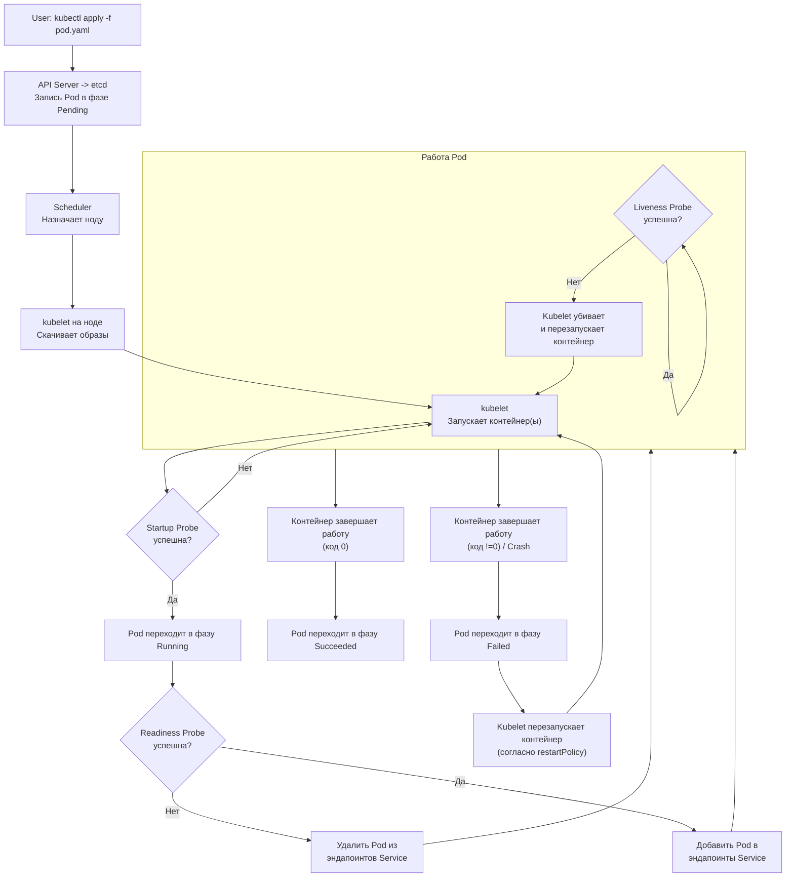

***

В отличие от виртуальных машин, Pod'ы с самого начала проектировались как **эфемерные (временные) и заменяемые сущности**. 

### Фазы (Phase) жизненного цикла Pod'а

У каждого Pod'а есть поле `status.phase`, которое описывает, на какой стадии жизненного цикла он находится:

1.  **`Pending` (Ожидание):**
    *   Pod принят API Server, его манифест записан в etcd.
    *   **Но:** Образы контейнеров可能还在 скачиваться, или Pod ждёт, когда **Scheduler** найдёт для него подходящую ноду.
    *   Если выполнить `kubectl get pods`, вы часто увидите Pod'ы в этом состоянии сразу после создания.
    *   *Частая причина задержки:* ожидание скачивания больших образов.

2.  **`Running` (Запущен):**
    *   Pod привязан к ноде.
    *   **Все контейнеры внутри Pod'а были созданы,** и как минимум один из них всё ещё работает (не завершил свою работу).
    *   Это желаемое состояние для рабочей нагрузки.

3.  **`Succeeded` (Успешно завершён):**
    *   **Все контейнеры в Pod'е успешно завершили свою работу** (т.е. их главный процесс завершился с кодом возврата 0).
    *   Характерно для **заданий (Jobs)**. Например, Pod, который выполнил миграцию базы данных и завершился.

4.  **`Failed` (Неудача):**
    *   **Все контейнеры в Pod'е завершились,** и как минимум один контейнер завершился **неудачно** (ненулевой код возврата или был завершён системой).
    *   Kubernetes будет перезапускать такие Pod'ы в зависимости от политики перезапуска (`restartPolicy`).

5.  **`Unknown` (Неизвестно):**
    *   Состояние Pod'а не может быть получено (обычно из-за проблем со связью с **kubelet** ноды, на которой работает Pod).
    *   Это тревожное состояние, часто указывающее на проблему с нодой.

---

### Состояния контейнеров (Container States)

Внутри каждой фазы Pod'а каждый контейнер также проходит свои состояния (поле `state`):

*   **`Waiting` (Ожидание):** Контейнер ещё не начал выполнение. В этом состоянии обычно указана `reason` (причина), например, `ContainerCreating` или `ImagePullBackOff`.
*   **`Running` (Запущен):** Контейнер работает без проблем.
*   **`Terminated` (Завершён):** Контейнер выполнил свою работу и завершился (успешно или нет). Содержит информацию о коде выхода и времени завершения.

Посмотреть детальную информацию о состоянии можно командой:
```bash
kubectl describe pod <pod-name>
```

---

### Ключевые события в жизненном цикле: Probes (Пробы)

Kuberness не просто ждёт, пока контейнер запустится. Он активно проверяет его "здоровье" с помощью **проб**. Это одна из самых важных особенностей жизненного цикла.

1.  **`Startup Probe`** (Проба старта)
    *   **Задача:** Дать контейнеру время на запуск. **Пока эта проба не станет успешной, все остальные пробы неактивны.**
    *   **Аналогия:** "Не трогай меня, я ещё загружаюсь!"
    *   **Использование:** Для "тяжелых" приложений, которым нужно много времени на старт (например, старые Java-приложения). Предотвращает их убийство до того, как они реально запустятся.

2.  **`Liveness Probe`** (Проба живости)
    *   **Задача:** Ответить на вопрос "Жив ли контейнер?". Если проба fails, **kubelet убивает контейнер и запускает его заново** (согласно `restartPolicy`).
    *   **Аналогия:** Медсестра щупает пульс. Если пульса нет — констатируем смерть и реанимируем.
    *   **Использование:** Для восстановления зависших приложений (у которых процесс жив, но они не отвечают).

3.  **`Readiness Probe`** (Проба готовности)
    *   **Задача:** Ответить на вопрос "Готов ли контейнер принимать трафик?". Если проба fails, **контейнер удаляется из всех Service'ов** (из списка эндпоинтов), но его **не перезапускают**.
    *   **Аналогия:** Официант говорит "Подождите минуточку, блюдо ещё не готово". Клиенты (трафик) ждут, но повара (контейнер) не увольняют.
    *   **Использование:** Для приложений, которым нужно время на подготовку (прогрев кэша, подключение к БД) после запуска.

**Пример определения проб в манифесте:**
```yaml
containers:
- name: my-app
  image: my-app:latest
  startupProbe:
    httpGet:
      path: /health-startup
      port: 8080
    failureThreshold: 30 # Проверяем 30 раз...
    periodSeconds: 10    # ...каждые 10 секунд => 300 сек на запуск
  livenessProbe:
    httpGet:
      path: /health
      port: 8080
    initialDelaySeconds: 5 # Ждём 5 сек после старта перед первой проверкой
    periodSeconds: 10       # Проверяем каждые 10 секунд
  readinessProbe:
    httpGet:
      path: /ready
      port: 8080
    initialDelaySeconds: 5
    periodSeconds: 5
```

---

### Визуализация полного жизненного цикла Pod'а



---

### Политика перезапуска (`restartPolicy`)

Это поле в spec Pod'а определяет, что делать, если контейнер завершается. Варианты:
*   **`Always`** (Всегда): Всегда перезапускать контейнер. Стандартный выбор для большинства сервисов.
*   **`OnFailure`** (При сбое): Перезапускать только если контейнер завершился с ошибкой.
*   **`Never`** (Никогда): Не перезапускать контейнер.

**Важно:** `restartPolicy` относится ко *всем контейнерам* в Pod'е. Она управляет перезапуском со стороны kubelet. Это не то же самое, что политика перезапуска самого Deployment'а.

### Итог: Почему это важно понимать?

1.  **Отладка:** Понимание фаз и состояний — это первый шаг к диагностике проблем. "Почему мой Pod в статусе `Pending`?" -> "Скорее всего, не хватает ресурсов на нодах".
2.  **Надёжность:** Правильно настроенные **Probes** — это заказ того, чтобы ваше приложение было отказоустойчивым и трафик шёл только к здоровым экземплярам.
3.  **Проектирование:** Вы начинаете проектировать приложения с учётом их временной природы ("**pets vs cattle**"). Ваше приложение должно быть готово к внезапной смерти и перерождению в любой момент.

***
#devops #k8s 