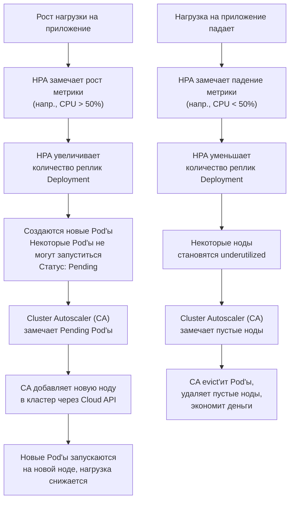

***

1.  **Горизонтальное масштабирование приложений (Scaling Applications):** Увеличение количества *экземпляров вашего приложения* (Pod'ов) для обработки возросшей нагрузки.
2.  **Масштабирование самого кластера (Scaling the Cluster):** Увеличение количества *рабочих серверов (нод)* в кластере, чтобы на них можно было разместить эти новые экземпляры приложений.

---

## 1. Горизонтальное масштабирование приложений (Horizontal Pod Scaling)

Это самый частый и быстрый способ реакции на нагрузку. Управляется он в основном через объекты **Deployment**, **ReplicaSet** или **StatefulSet**.

### A. Ручное масштабирование
Самый простой способ. Администратор вручную меняет количество реплик.

**Команда:**
```bash
kubectl scale deployment/my-app --replicas=5
```
**Или через редактирование Deployment:**
```bash
kubectl edit deployment my-app # Меняем поле `spec.replicas` и сохраняемся.
```
**Плюсы:** Просто, предсказуемо.
**Минусы:** Требует постоянного внимания человека, не успевает за резкими скачками нагрузки.

### B. Автоматическое масштабирование (Horizontal Pod Autoscaler - HPA)
**HPA** — это встроенный механизм Kubernetes, который **автоматически** увеличивает или уменьшает количество Pod'ов в Deployment, ReplicaSet или StatefulSet на основе наблюдаемой метрики нагрузки (например, загрузки CPU или потребления памяти).

**Как работает HPA:**
1.  HPA-контроллер постоянно опрашивает Metrics Server (или другую систему, например, Prometheus) о текущей нагрузке на Pod'ы.
2.  Он вычисляет среднее значение метрики по всем Pod'ам.
3.  Сравнивает это значение с целевым (target), который вы указали.
4.  По формуле определяет желаемое количество реплик и обновляет поле `.spec.replicas` у Deployment.

**Пример создания HPA, который масштабирует Deployment `my-app` по CPU (цель - 50% утилизации):**
```bash
kubectl autoscale deployment my-app --cpu-percent=50 --min=2 --max=10
```
**Или через манифест YAML:**
```yaml
apiVersion: autoscaling/v2
kind: HorizontalPodAutoscaler
metadata:
  name: my-app-hpa
spec:
  scaleTargetRef:
    apiVersion: apps/v1
    kind: Deployment
    name: my-app # Какой объект масштабируем
  minReplicas: 2  # Минимальное количество Pod'ов
  maxReplicas: 10 # Максимальное количество Pod'ов
  metrics:
  - type: Resource
    resource:
      name: cpu
      target:
        type: Utilization
        averageUtilization: 50 # Целевая средняя утилизация CPU
```
**Плюсы:** Полная автоматизация, быстрое реагирование на нагрузку.
**Минусы:** Требует настройки и понимания метрик; не все приложения хорошо масштабируются от CPU/Memory.

#### C. Продвинутое автомасштабирование на кастомных метриках
HPA можно настроить на масштабирование по любым метрикам, например:
*   **QPS (Queries Per Second)** вашего ingress-контроллера.
*   **Длина очереди сообщений** в RabbitMQ или Kafka.
*   **Количество подключений** к базе данных.
*   **Любая бизнес-метрика** (например, количество заказов в секунду).

Для этого обычно используется связка **Prometheus** (для сбора метрик) + **Prometheus Adapter** (чтобы предоставлять эти метрики Kubernetes API).

---

### 2. Масштабирование самого кластера (Cluster Scaling)

Если в кластере закончились ресурсы (CPU, RAM) для запуска новых Pod'ов, нужно добавить новые рабочие ноды. Это тоже можно автоматизировать.

#### A. Ручное добавление/удаление нод
Администратор вручную подготавливает новый сервер (виртуальную машину), устанавливает на него компоненты Worker Node (`kubelet`, `kube-proxy`, container runtime) и присоединяет его к кластеру.

**Плюсы:** Полный контроль.
**Минусы:** Очень медленно (минуты/часы), требует ручного труда.

#### B. Автоматическое масштабирование кластера (Cluster Autoscaler - CA)
**Cluster Autoscaler** — это компонент, который **автоматически добавляет новые ноды в пул и удаляет неиспользуемые ноды**.

**Как работает Cluster Autoscaler:**
1.  **Когда Pod не может быть запущен** из-за нехватки ресурсов в кластере (переходит в состояние `Pending`), CA замечает это.
2.  CA взаимодействует с API вашего cloud-провайдера (AWS, GCP, Azure и т.д.) и **заказывает создание новой виртуальной машины** (ноды) в том же пуле узлов (NodeGroup).
3.  Новая нода автоматически присоединяется к кластеру.
4.  **Когда нода长时间 underutilized** (на ней мало Pod'ов), CA вычисляет, можно ли переместить эти Pod'ы на другие ноды.
5.  Если можно, он **кординирует удаление ноды**: помечает ноду к удалению, evict'ит Pod'ы на другие ноды, а затем удаляет пустую ноду через API cloud-провайдера.

**Важно:** CA работает на уровне групп нод (Node Groups), а не отдельных серверов.

**Плюсы:** Полная автоматизация инфраструктуры, экономия денег (удаление пустых нод).
**Минусы:** Требует поддержки cloud-провайдера; настройка может быть complex.

#### C. Вертикальное автомасштабирование (Vertical Pod Autoscaler - VPA)
**VPA** — это менее распространенный, но мощный инструмент, который **автоматически настраивает запросы (requests) и лимиты (limits) CPU и памяти для ваших Pod'ов**.

*   Он анализирует историческое потребление ресурсов Pod'ом.
*   Если Pod постоянно упирается в лимит и его убивает OOMKiller, VPA предложит увеличить `limits.memory`.
*   Если Pod запросил слишком много CPU, но использует мало, VPA предложит уменьшить `requests.cpu`, чтобы на ноде освободились ресурсы для других Pod'ов.

VPA может работать в режиме советчика (Recommender) или автоматически применять изменения (Auto mode). Его часто используют в паре с HPA.

---

### Визуализация полного цикла автомасштабирования



### Итог: Какие способы выбрать?

1.  **Всегда настраивайте HPA** для ваших основных workload'ов. Это основа отзывчивости на нагрузку.
2.  **Обязательно используйте Cluster Autoscaler**, если ваш кластер развернут в облаке. Это основа эластичности инфраструктуры и экономии средств.
3.  **Рассмотрите VPA** для stage-окружений или для приложений, чье потребление ресурсов плохо предсказуемо. Это помогает оптимизировать использование ресурсов и избежать "простоев" из-за нехватки памяти.
4.  **Ручное масштабирование** оставьте для edge-кейсов, отладки и ситуаций, где требуется полный контроль.

Идеальный сценарий — это связка **HPA + Cluster Autoscaler**, когда ваше приложение и инфраструктура под ним полностью автоматически реагируют на любую нагрузку.

***
#devops #k8s 