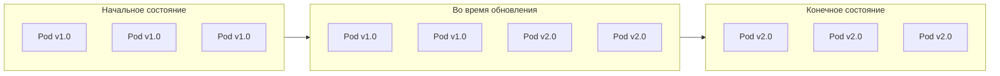
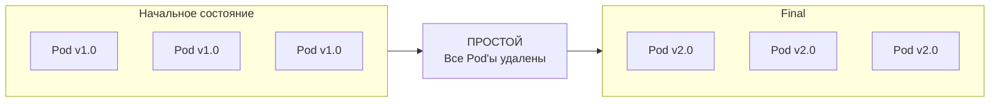
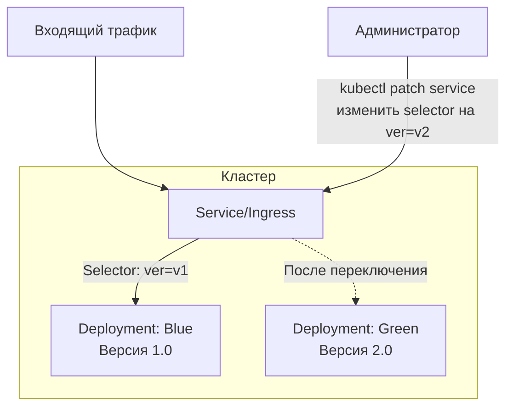
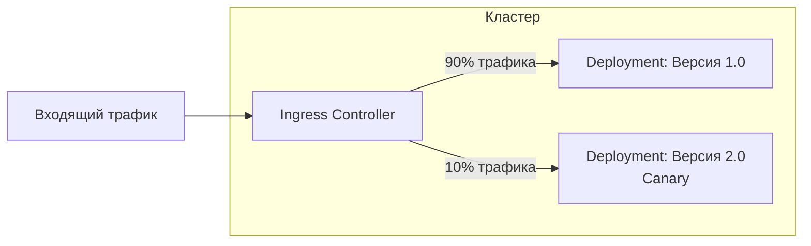

***
**Стратегии развертывания (Deployment Strategies)** определяют, *как именно* новое версия вашего приложения заменяет старую. Выбор стратегии — это компромисс между скоростью, риском, доступностью и сложностью.

Kubernetes нативно поддерживает первые две стратегии (RollingUpdate и Recreate). Остальные реализуются с помощью дополнительных объектов Kubernetes (Service, Ingress) и инструментов.

---

### 1. Rolling Update (Постепенное обновление)
****Стратегия по умолчанию** для объектов Deployment.

**Как работает:**
1.  Постепенно создаёт Pod'ы с новой версией (v2).
2.  Постепенно удаляет Pod'ы со старой версией (v1).
3.  В процессе обновления **оба версии приложения работают одновременно** и обрабатывают трафик.

**Преимущества:**
*   **Нулевое время простоя (Zero Downtime):** Приложение доступно на протяжении всего обновления.
*   **Плавное обновление:** Нагрузка постепенно переходит на новую версию.
*   **Автоматический откат:** Если пробы готовности (readiness) новых Pod'ов начинают фейлиться, обновление автоматически приостанавливается.

**Недостатки:**
*   **Сложность совместимости:** На время обновления старые и новые версии работают одновременно. Они должны быть совместимы друг с другом (например, по форматам сообщений в очереди или схеме БД).
*   **Более медленное развертывание.**

**Как использовать в Kubernetes:**
В стратегии Deployment:
```yaml
apiVersion: apps/v1
kind: Deployment
spec:
  strategy:
    type: RollingUpdate
    rollingUpdate:
      maxSurge: 25%        # Сколько Pod'ов "сверху" можно создать (может быть в %, например, 25%, или абсолютное число, например, 1)
      maxUnavailable: 25%  # Сколько Pod'ов "снизу" может быть недоступно во время обновления
```
*Визуализация Rolling Update:*


---

### 2. Recreate (Пересоздание)
Самая простая стратегия.

**Как работает:**
1.  **Удаляет все Pod'ы старой версии (v1).** Приложение полностью недоступно.
2.  **Создает все Pod'ы новой версии (v2).**

**Преимущества:**
*   **Простота:** Нет проблем с совместимостью версий, так как они не работают одновременно.
*   **Предсказуемость:** Приложение запускается "с чистого листа".

**Недостатки:**
*   **Значительный простой (Downtime):** Приложение недоступно на всё время обновления.

**Как использовать в Kubernetes:**
В стратегии Deployment:
```yaml
apiVersion: apps/v1
kind: Deployment
spec:
  strategy:
    type: Recreate
```
*Визуализация Recreate:*


---

### 3. Blue-Green (Сине-зелёное развертывание)

**Как работает:**
1.  Разворачивается **полностью новая версия** приложения (Green) **рядом со старой** (Blue). Это два абсолютно независимых набора Pod'ов/Deployment'ов.
2.  Тестирование: Новая версия тестируется, не получая пользовательский трафик.
3.  **Мгновенное переключение:** Как только тесты пройдены, весь трафик с помощью Service или Ingress перенаправляется с Blue на Green.
4.  Старая версия (Blue) какое-то время работает "на подхвате" на случай быстрого отката, после чего удаляется.

**Преимущества:**
*   **Мгновенное развертывание и откат:** Переключение трафика происходит почти мгновенно.
*   **Минимальный риск:** Новая версия полностью развёрнута и протестирована до переключения.
*   **Простота:** Нет проблем с совместимостью, версии не работают одновременно.

**Недостатки:**
*   **Высокие ресурсные затраты:** Требует 2x ресурсов на время развертывания.
*   **Сложнее в настройке:** Требует управления Service/Ingress.

**Как реализовать в Kubernetes:**
Используются два разных Deployment'а (`my-app-blue`, `my-app-green`) и один Service, который selector'ом указывает на одну из версий. Переключение — это изменение меток в selector'е Service.
*Визуализация Blue-Green:*


---

### 4. Canary (Канареечное развертывание)

**Как работает:**
1.  Новая версия разворачивается **для небольшой части пользователей** (например, 5-10%).
2.  Собираются метрики (производительность, ошибки) и feedback.
3.  Если всё хорошо, новая версия постепенно выкатывается на всё большее число пользователей, пока полностью не заменит старую.
4.  Если что-то пошло не так, новая версия быстро откатывается.

**Преимущества:**
*   **Минимизация риска:** Проблема затронет только небольшую группу пользователей.
*   **Возможность тестирования в продакшене:** Реальное нагрузочное тестирование и сбор фидбека.

**Недостатки:**
*   **Наибольшая сложность:** Требует продвинутого контроля трафика (часто через Ingress-контроллеры или Service Mesh).
*   **Долгий процесс полного развертывания.**

**Как реализовать в Kubernetes:**
Часто с помощью Ingress-контроллеров (Nginx, Istio, Traefik), которые поддерживают весовую маршрутизацию (weight-based routing).
*Визуализация Canary:*


---

### 5. A/B Testing (А/Б-тестирование) / Dark Launches

**Как работает:**
*   Это скорее **цель**, для которой используется Canary-подход.
*   Новая версия (B) разворачивается для **определённой сегментированной группы пользователей** (не случайной!).
*   Сегментация может быть по: геолокации, языку, типу устройства, cookie, заголовкам и т.д.
*   Цель — не столько безопасный деплой, сколько **сравнение производительности двух версий** (A и B) или тестирование новой фичи на focus-группе.

**Как реализовать в Kubernetes:**
Требуются мощные инструменты для тонкого контроля трафика, такие как **Service Mesh (Istio)** или **Ingress-контроллеры** с поддержкой правил на основе заголовков.
```yaml
# Пример правила Istio VirtualService для A/B теста
apiVersion: networking.istio.io/v1beta1
kind: VirtualService
spec:
  hosts:
  - my-app.com
  http:
  - match:
    - headers:
        cookie:
          regex: ".*group=beta.*" # Правило: если в cookie есть 'group=beta'
    route:
    - destination:
        host: my-app-v2-service # ... отправлять на версию 2.0
  - route: # Все остальные...
    - destination:
        host: my-app-v1-service # ... отправлять на версию 1.0
```

### Сводная таблица

| Стратегия | Скорость | Простой | Риск | Ресурсы | Совместимость версий |
| :--- | :--- | :--- | :--- | :--- | :--- |
| **Recreate** | Быстро | **Есть** | Высокий | Низкие | Не важна |
| **Rolling** | Медленно | **Нет** | Средний | Низкие | **Критична** |
| **Blue-Green** | Очень быстро | **Нет** | Низкий | **Высокие (2x)** | Не важна |
| **Canary** | Очень медленно | **Нет** | **Очень низкий** | Средние | **Критична** |
| **A/B Test** | Зависит | **Нет** | Низкий | Средние | **Критична** |

**Вывод:** Нет "лучшей" стратегии. Есть стратегия, которая лучше всего подходит для конкретного приложения, его требований к доступности и допустимого уровня риска.
***
#devops #k8s 